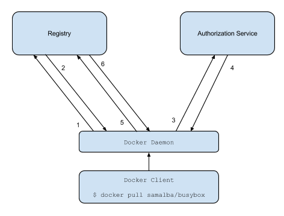

# Docker Registry v2 Authentication
Docker Registry v2 Authentication 流程如下：


1. 准备往registry进行push/pull操作。
2. 如果registry需要authorization，将会返回一个401 Unauthorized HTTP的响应，并且响应中包含如何认证的信息。
3. Registry client向authorization service发起认证的请求，请求一个Bearer token。
4. Authorization service返回一个对用户透明的Bearer token，代表用户的授权。
5. Registry client重试请求，本次请求在请求头中带有Bearer token。
6. Registry验证Bearer token and the claim set，然后授权client，开始push/pull。

## Requirements
* Registry clients：能够理解并响应resource server返回的认证要求。
* Authorization server：能够管理资源服务器托管的资源的权限控制(比如Docker Registry中的Repository)。
* Docker Registry：信任authorization server签发的tokens，并且能够验证token的合法性。

## Authorization Server Endpoint Descriptions
Authorization Server提供对Resource Provider的访问控制功能。
Reource Provider使用Authorization Server提供的认证和授权功能。

官方的Docker Registry使用Authorization Server来认证客户端并验证对image repositories的授权。

## How to authenticate
Registry V1 clients会首先联系index，来发起push或者pull请求。在Registry V2的工作流中，clients应该首先向registry发起请求。如果registry server需要认证，将会返回401 Unauthorized响应，响应头中包含WWW-Authenticate header，指出如何认证。

例如，我(username jlhawn)试图往registry上传（push）一个镜像repo：samalba/my-app。由于registry需要认证，我会收到如下响应：

```HTTP
HTTP/1.1 401 Unauthorized
Content-Type: application/json; charset=utf-8
Docker-Distribution-Api-Version: registry/2.0
Www-Authenticate: Bearer realm="https://auth.docker.io/token",service="registry.docker.io",scope="repository:samalba/my-app:pull,push"
Date: Thu, 10 Sep 2015 19:32:31 GMT
Content-Length: 235
Strict-Transport-Security: max-age=31536000

{"errors":[{"code":"UNAUTHORIZED","message":"access to the requested resource is not authorized","detail":[{"Type":"repository","Name":"samalba/my-app","Action":"pull"},{"Type":"repository","Name":"samalba/my-app","Action":"push"}]}]}
```

HTTP Response Header指明了认证请求：

```HTTP
Www-Authenticate: Bearer realm="https://auth.docker.io/token",service="registry.docker.io",scope="repository:samalba/my-app:pull,push"

```

这个请求指出：the registry需要指定的认证服务器auth.docker.io签发的token。客户端（client）需要往https://auth.docker.io/token发请求：包含service和scope。

## Requesting a Token


