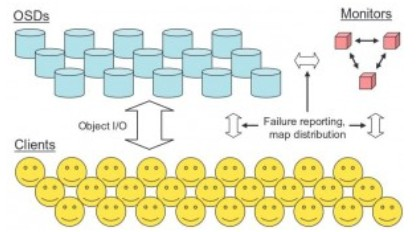

# Ceph的结构
## Ceph系统的层次结构
Ceph存储系统的逻辑层次结构如下图所示：

自下向上，可以将Ceph系统分为四个层次：
### 基础存储系统RADOS
RADOS：Reliable, Autonomic, Distributed Object Store，即可靠的、自动化的、分布式的对象存储。
顾名思义，这一层本身就是一个完整的对象存储系统，所有存储在Ceph系统中的用户数据事实上最终都是由这一层来存储的。而Ceph的高可靠、高可扩展、高性能、高自动化等特性本质上也是由这一层所提供的。因此，理解RADOS是理解Ceph的基础与关键。

物理上，RADOS由大量的存储设备节点组层，每个节点拥有自己的硬件资源（CPU、内存、硬盘、网络），并运行着操作系统和文件系统。

### 基础库librados 
这一层的功能是对RADOS进行抽象和封装，并向上层提供API，以便直接基于RADOS（而不是整个Ceph）进行应用开发。

特别要注意的是，**RADOS是一个对象存储系统**，因此，**librados实现的API也只是针对对象存储功能的**。

RADOS采用C++开发，所提供的原生librados API包括C和C++两种。**物理上，librados和基于其上开发的应用位于同一台机器**，因而也被称为本地API。应用调用本机上的librados API，再由后者通过socket与RADOS集群中的节点通信并完成各种操作。

### 高层应用接口
这一层包括了三个部分：RADOS GW（RADOS Gateway）、 RBD（Reliable Block Device）和Ceph FS（Ceph File System），其作用是在librados库的基础上提供抽象层次更高、更便于应用或客户端使用的上层接口。
* RADOS GW是一个提供与Amazon S3和Swift兼容的RESTful API的gateway，以供相应的对象存储应用开发使用。RADOS GW提供的API抽象层次更高，但功能则不如librados强大。因此，开发者应针对自己的需求选择使用。
* RBD则提供了一个标准的块设备接口，常用于在虚拟化的场景下为虚拟机创建volume。目前，Red Hat已经将RBD驱动集成在KVM/QEMU中，以提高虚拟机访问性能。
* Ceph FS是一个POSIX兼容的分布式文件系统。由于还处在开发状态，因而Ceph官网并不推荐将其用于生产环境中。

### 应用层
这一层就是不同场景下对于Ceph各个应用接口的各种应用方式，例如基于librados直接开发的对象存储应用，基于RADOS GW开发的对象存储应用，基于RBD实现的云硬盘等等。

一个容易产生的困惑就是：RADOS自身既然已经是一个对象存储系统，并且也可以提供librados API，为何还要再单独开发一个RADOS GW？

理解这个问题，事实上有助于理解RADOS的本质。粗看起来，librados和RADOS GW的区别在于，librados提供的是本地API，而RADOS GW提供的则是RESTful API，二者的编程模型和实际性能不同。而更进一步说，则和这两个不同抽象层次的目标应用场景差异有关。换言之，虽然RADOS和S3、Swift同属分布式对象存储系统，但RADOS提供的功能更为基础、也更为丰富。这一点可以通过对比看出。

由于Swift和S3支持的API功能近似，这里以Swift举例说明。
Swift提供的API功能主要包括：
* 用户管理操作：用户认证、获取账户信息、列出容器列表等；
* 容器管理操作：创建/删除容器、读取容器信息、列出容器内对象列表等；
* 对象管理操作：对象的写入、读取、复制、更新、删除、访问许可设置、元数据读取或更新等。

由此可见，Swift（以及S3）提供的API所操作的“对象”只有三个：用户账户、用户存储数据对象的容器、数据对象。
并且，所有的操作均不涉及存储系统的底层硬件或系统信息。
不难看出，这样的API设计完全是针对对象存储应用开发者和对象存储应用用户的，并且假定其开发者和用户关心的内容更偏重于账户和数据的管理，而对底层存储系统细节不感兴趣，更不关心效率、性能等方面的深入优化。 

而librados API的设计思想则与此完全不同。
一方面，librados中没有账户、容器这样的高层概念；另一方面，librados API向开发者开放了大量的RADOS状态信息与配置参数，允许开发者对RADOS系统以及其中存储的对象的状态进行观察，并强有力地对系统存储策略进行控制。
换言之，通过调用librados API，应用不仅能够实现对数据对象的操作，还能够实现对RADOS系统的管理和配置。这对于S3和Swift的RESTful API设计是不可想像的，也是没有必要的。 

基于上述分析对比，不难看出，librados事实上更适合对于系统有着深刻理解，同时对于功能定制扩展和性能深度优化有着强烈需求的高级用户。基于librados的开发可能更适合于在私有Ceph系统上开发专用应用，或者为基于Ceph的公有存储系统开发后台数据管理、处理应用。而RADOS GW则更适合于常见的基于web的对象存储应用开发，例如公有云上的对象存储服务。 

## RADOS的逻辑结构
RADOS的系统逻辑结构如下图所示：

在使用RADOS系统时，大量的客户端程序通过与OSD或者monitor的交互获取cluster map，然后直接在本地进行计算，得出对象的存储位置后，便直接与对应的OSD通信，完成数据的各种操作。
可见，在此过程中，只要保证cluster map不频繁更新，则客户端显然可以不依赖于任何元数据服务器，不进行任何查表操作，便完成数据访问流程。
在RADOS的运行过程中，cluster map的更新完全取决于系统的状态变化，而导致这一变化的常见事件只有两种：**OSD出现故障，或者RADOS规模扩大**。而正常应用场景下，这两种事件发生的频率显然远远低于客户端对数据进行访问的频率。 

## OSD的逻辑结构
根据定义，OSD可以被抽象为两个组成部分：
* 系统部分
* 守护进程（OSD deamon）部分 

OSD的系统部分本质上就是一台安装了操作系统和文件系统的计算机，其硬件部分至少包括一个单核的处理器、一定数量的内存、一块硬盘以及一张网卡。 
由于这么小规模的x86架构服务器并不实用（事实上也见不到），因而实际应用中通常将多个OSD集中部署在一台更大规模的服务器上。在选择系统配置时，应当能够保证每个OSD占用一定的计算能力、一定量的内存和一块硬盘。同时，应当保证该服务器具备足够的网络带宽。

在上述系统平台上，每个OSD拥有一个自己的OSD deamon。这个deamon负责完成OSD的所有逻辑功能，包括与monitor和其他OSD（事实上是其他OSD的deamon）通信以维护更新系统状态，与其他OSD共同完成数据的存储和维护，与client通信完成各种数据对象操作等等。 

如图所示，RADOS集群主要由两种节点组成。
* 一种是为数众多的、负责完成数据存储和维护功能的OSD（Object Storage Device）。
* 另一种则是若干个负责完成系统状态检测和维护的monitor。

OSD和monitor之间相互传输节点状态信息，共同得出系统的总体工作状态，并形成一个全局系统状态记录数据结构，即所谓的cluster map。这个数据结构与RADOS提供的特定算法相配合，便实现了Ceph**无需查表，算算就好**的核心机制以及若干优秀特性。 

注：本文转自http://www.csdn.net/article/2014-04-08/2819192-ceph-swift-on-openstack-m/1