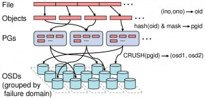

# Ceph的工作原理和流程
Ceph的功能实现本质上依托于RADOS，因而，此处的介绍事实上也是针对RADOS进行。
## 寻址流程
Ceph系统中的寻址流程如下图所示：

上图左侧的几个概念说明如下：

1. File：file就是用户需要存储或者访问的文件。对于一个基于Ceph开发的对象存储应用而言，这个file也就对应于应用中的“对象”，也就是用户直接操作的“对象”。
2. Ojbect：object是RADOS所看到的“对象”。Object与上面提到的file的区别是，object的最大size由RADOS限定（通常为2MB或4MB），以便实现底层存储的组织管理。因此，当上层应用向RADOS存入size很大的file时，需要将file切分成统一大小的一系列object（最后一个的大小可以不同）进行存储。
3. PG（Placement Group)：顾名思义，PG的用途是对object的存储进行组织和位置映射。具体而言，一个PG负责组织若干个object（可以为数千个甚至更多），但一个object只能被映射到一个PG中，即，PG和object之间是“一对多”映射关系。同时，一个PG会被映射到n个OSD上，而每个OSD上都会承载大量的PG，即，PG和OSD之间是“多对多”映射关系。在实践当中，n至少为2，如果用于生产环境，则至少为3。一个OSD上的PG则可达到数百个。事实上，PG数量的设置牵扯到数据分布的均匀性问题。
4. OSD：即object storage device，OSD的数量事实上也关系到系统的数据分布均匀性，因此其数量不应太少。在实践当中，至少也应该是数十上百个的量级才有助于Ceph系统的设计发挥其应有的优势。
5. Failure domain：故障域。

基于上述定义，便可以对寻址流程进行解释了。具体而言，Ceph中的寻址至少要经历以下三次映射：
1. File -> object映射

这次映射的目的是，将用户要操作的file，映射为RADOS能够处理的object。其映射十分简单，本质上就是按照object的最大size对file进行切分，相当于RAID中的条带化过程。这种切分的好处有二：一是让大小不限的file变成最大size一致、可以被RADOS高效管理的object；二是让对单一file实施的串行处理变为对多个object实施的并行化处理。

每一个切分后产生的object将获得唯一的oid，即object id。其产生方式也是线性映射，极其简单。图中，ino是待操作file的元数据，可以简单理解为该file的唯一id。ono则是由该file切分产生的某个object的序号。而oid就是将这个序号简单连缀在该file id之后得到的。举例而言，如果一个id为filename的file被切分成了三个object，则其object序号依次为0、1和2，而最终得到的oid就依次为filename0、filename1和filename2。

这就意味着，ino的唯一性必须得到保证，否则后续映射无法正确进行。

2. Object -> PG映射

在file被映射为一个或多个object之后，就需要将每个object独立地映射到一个PG中去。这个映射过程也很简单，如图中所示，其计算公式是：

hash(oid) & mask -> pgid

由此可见，其计算由两步组成。首先是使用Ceph系统指定的一个静态哈希函数计算oid的哈希值，将oid映射成为一个近似均匀分布的伪随机值。然后，将这个伪随机值和mask按位相与，得到最终的PG序号（pgid）。根据RADOS的设计，给定PG的总数为m（m应该为2的整数幂），则mask的值为m-1。因此，哈希值计算和按位与操作的整体结果事实上是从所有m个PG中近似均匀地随机选择一个。基于这一机制，当有大量object和大量PG时，RADOS能够保证object和PG之间的近似均匀映射。又因为object是由file切分而来，大部分object的size相同，因而，这一映射最终保证了，各个PG中存储的object的总数据量近似均匀。

从介绍不难看出，这里反复强调了“大量”。只有当object和PG的数量较多时，这种伪随机关系的近似均匀性才能成立，Ceph的数据存储均匀性才有保证。为保证“大量”的成立，一方面，object的最大size应该被合理配置，以使得同样数量的file能够被切分成更多的object；另一方面，Ceph也推荐PG总数应该为OSD总数的数百倍，以保证有足够数量的PG可供映射。

3. PG -> OSD映射

第三次映射就是将作为object的逻辑组织单元的PG映射到数据的实际存储单元OSD。如图所示，RADOS采用一个名为**CRUSH**的算法，将pgid代入其中，然后得到一组共n个OSD。这n个OSD即共同负责存储和维护一个PG中的所有object。前已述及，n的数值可以根据实际应用中对于可靠性的需求而配置，在生产环境下通常为3。具体到每个OSD，则由其上运行的OSD deamon负责执行映射到本地的object在本地文件系统中的存储、访问、元数据维护等操作。

和“object -> PG”映射中采用的哈希算法不同，这个CRUSH算法的结果不是绝对不变的，而是受到其他因素的影响。其影响因素主要有二：
* 一是当前系统状态，也就是上文逻辑结构中曾经提及的cluster map。当系统中的OSD状态、数量发生变化时，cluster map可能发生变化，而这种变化将会影响到PG与OSD之间的映射。
* 二是存储策略配置。这里的策略主要与安全相关。利用策略配置，系统管理员可以指定承载同一个PG的3个OSD分别位于数据中心的不同服务器乃至机架上，从而进一步改善存储的可靠性。

因此，只有在系统状态（cluster map）和存储策略都不发生变化的时候，PG和OSD之间的映射关系才是固定不变的。
在实际使用当中，策略一经配置通常不会改变。
而系统状态的改变或者是由于设备损坏，或者是因为存储集群规模扩大。
好在Ceph本身提供了对于这种变化的自动化支持，因而，即便PG与OSD之间的映射关系发生了变化，也并不会对应用造成困扰。事实上，Ceph正是需要有目的的利用这种动态映射关系。正是利用了CRUSH的动态特性，Ceph可以将一个PG根据需要动态迁移到不同的OSD组合上，从而自动化地实现高可靠性、数据分布re-blancing等特性。

之所以在此次映射中使用CRUSH算法，而不是其他哈希算法，原因之一正是CRUSH具有上述可配置特性，可以根据管理员的配置参数决定OSD的物理位置映射策略；另一方面是因为CRUSH具有特殊的“稳定性”，也即，当系统中加入新的OSD，导致系统规模增大时，大部分PG与OSD之间的映射关系不会发生改变，只有少部分PG的映射关系会发生变化并引发数据迁移。这种可配置性和稳定性都不是普通哈希算法所能提供的。
因此，CRUSH算法的设计也是Ceph的核心内容之一。

至此为止，Ceph通过三次映射，完成了从file到object、PG和OSD整个映射过程。通观整个过程，可以看到，这里没有任何的全局性查表操作需求。至于唯一的全局性数据结构cluster map，维护和操作都是轻量级的，不会对系统的可扩展性、性能等因素造成不良影响。

一个可能出现的困惑是：为什么需要同时设计第二次和第三次映射？难道不重复么？关于这一点，Sage在其论文中解说不多，而笔者个人的分析如下：

我们可以反过来想像一下，如果没有PG这一层映射，又会怎么样呢？在这种情况下，一定需要采用某种算法，将object直接映射到一组OSD上。如果这种算法是某种固定映射的哈希算法，则意味着一个object将被固定映射在一组OSD上，当其中一个或多个OSD损坏时，object无法被自动迁移至其他OSD上（因为映射函数不允许），当系统为了扩容新增了OSD时，object也无法被re-balance到新的OSD上（同样因为映射函数不允许）。这些限制都违背了Ceph系统高可靠性、高自动化的设计初衷。

如果采用一个动态算法（例如仍然采用CRUSH算法）来完成这一映射，似乎是可以避免静态映射导致的问题。但是，其结果将是各个OSD所处理的本地元数据量爆增，由此带来的计算复杂度和维护工作量也是难以承受的。例如，在Ceph的现有机制中，一个OSD平时需要和与其共同承载同一个PG的其他OSD交换信息，以确定各自是否工作正常，是否需要进行维护操作。由于一个OSD上大约承载数百个PG，每个PG内通常有3个OSD，因此，一段时间内，一个OSD大约需要进行数百至数千次OSD信息交换。然而，如果没有PG的存在，则一个OSD需要和与其共同承载同一个object的其他OSD交换信息。由于每个OSD上承载的object很可能高达数百万个，因此，同样长度的一段时间内，一个OSD大约需要进行的OSD间信息交换将暴涨至数百万乃至数千万次。而这种状态维护成本显然过高。

综上所述，笔者认为，引入PG的好处至少有二：一方面实现了object和OSD之间的动态映射，从而为Ceph的可靠性、自动化等特性的实现留下了空间；另一方面也有效简化了数据的存储组织，大大降低了系统的维护管理开销。理解这一点，对于彻底理解Ceph的对象寻址机制，是十分重要的。

## 数据操作流程
此处将首先以file写入过程为例，对数据操作流程进行说明。

为简化说明，便于理解，此处进行若干假定。首先，假定待写入的file较小，无需切分，仅被映射为一个object。其次，假定系统中一个PG被映射到3个OSD上。

基于上述假定，则file写入流程可以被下图表示：

如图所示，当某个client需要向Ceph集群写入一个file时，首先需要在本地完成寻址流程，将file变为一个object，然后找出存储该object的一组三个OSD。这三个OSD具有各自不同的序号，序号最靠前的那个OSD就是这一组中的Primary OSD，而后两个则依次是Secondary OSD和Tertiary OSD。

找出三个OSD后，client将直接和Primary OSD通信，发起写入操作（步骤1）。Primary OSD收到请求后，分别向Secondary OSD和Tertiary OSD发起写入操作（步骤2、3）。当Secondary OSD和Tertiary OSD各自完成写入操作后，将分别向Primary OSD发送确认信息（步骤4、5）。当Primary OSD确信其他两个OSD的写入完成后，则自己也完成数据写入，并向client确认object写入操作完成（步骤6）。

之所以采用这样的写入流程，本质上是为了保证写入过程中的可靠性，尽可能避免造成数据丢失。同时，由于client只需要向Primary OSD发送数据，因此，在Internet使用场景下的外网带宽和整体访问延迟又得到了一定程度的优化。

当然，这种可靠性机制必然导致较长的延迟，特别是，如果等到所有的OSD都将数据写入磁盘后再向client发送确认信号，则整体延迟可能难以忍受。因此，Ceph可以分两次向client进行确认。当各个OSD都将数据写入内存缓冲区后，就先向client发送一次确认，此时client即可以向下执行。待各个OSD都将数据写入磁盘后，会向client发送一个最终确认信号，此时client可以根据需要删除本地数据。

分析上述流程可以看出，在正常情况下，client可以独立完成OSD寻址操作，而不必依赖于其他系统模块。因此，大量的client可以同时和大量的OSD进行并行操作。同时，如果一个file被切分成多个object，则多个object也可被并行发送至多个OSD。

从OSD的角度来看，由于同一个OSD在不同的PG中的角色不同，因此，其工作压力也可以被尽可能均匀地分担，从而避免单个OSD变成性能瓶颈。

如果需要读取数据，client只需完成同样的寻址过程，并直接和Primary OSD联系。**目前的Ceph设计中，被读取的数据仅由Primary OSD提供**。

## 集群维护
前面的介绍中已经提到，由若干个monitor共同负责整个Ceph集群中所有OSD状态的发现与记录，并且共同形成cluster map的master版本，然后扩散至全体OSD以及client。OSD使用cluster map进行数据的维护，而client使用cluster map进行数据的寻址。

在集群中，各个monitor的功能总体上是一样的，其相互间的关系可以被简单理解为主从备份关系。因此，在下面的讨论中不对各个monitor加以区分。

略显出乎意料的是，monitor并不主动轮询各个OSD的当前状态。正相反，OSD需要向monitor上报状态信息。常见的上报有两种情况：
* 一是新的OSD被加入集群，
* 二是某个OSD发现自身或者其他OSD发生异常。
在收到这些上报信息后，monitor将更新cluster map信息并加以扩散。

### Cluster map
Cluster map的实际内容包括：
1. Epoch，即版本号。Cluster map的epoch是一个单调递增序列。Epoch越大，则cluster map版本越新。因此，持有不同版本cluster map的OSD或client可以简单地通过比较epoch决定应该遵从哪个版本。而monitor必定有epoch最大、版本最新的cluster map。当任意两方在通信时发现彼此epoch值不同时，将默认先将cluster map同步至高版本一方的状态，再进行后续操作。
2. 各个OSD的网络地址。
3. 各个OSD的状态。OSD状态的描述分为两个维度：up或者down（表明OSD是否正常工作），in或者out（表明OSD是否在至少一个PG中）。因此，对于任意一个OSD，共有四种可能的状态：
* Up且in：说明该OSD正常运行，且已经承载至少一个PG的数据。这是一个OSD的标准工作状态；
* Up且out：说明该OSD正常运行，但并未承载任何PG，其中也没有数据。一个新的OSD刚刚被加入Ceph集群后，便会处于这一状态。而一个出现故障的OSD被修复后，重新加入Ceph集群时，也是处于这一状态；
* Down且in：说明该OSD发生异常，但仍然承载着至少一个PG，其中仍然存储着数据。这种状态下的OSD刚刚被发现存在异常，可能仍能恢复正常，也可能会彻底无法工作；
* Down且out：说明该OSD已经彻底发生故障，且已经不再承载任何PG。
4. CRUSH算法配置参数。表明了Ceph集群的物理层级关系（cluster hierarchy），位置映射规则（placement rules）。

根据cluster map的定义可以看出，其版本变化通常只会由（3）和（4）两项信息的变化触发。而这两者相比，（3）发生变化的概率更高一些。这可以通过下面对OSD工作状态变化过程的介绍加以反映。

### OSD上线过程
一个新的OSD上线后，首先根据配置信息与monitor通信。Monitor将其加入cluster map，并设置为up且out状态，再将最新版本的cluster map发给这个新OSD。

收到monitor发来的cluster map之后，这个新OSD计算出自己所承载的PG（为简化讨论，此处我们假定这个新的OSD开始只承载一个PG），以及和自己承载同一个PG的其他OSD。然后，新OSD将与这些OSD取得联系。如果这个PG目前处于降级状态（即承载该PG的OSD个数少于正常值，如正常应该是3个，此时只有2个或1个。这种情况通常是OSD故障所致），则其他OSD将把这个PG内的所有对象和元数据复制给新OSD。数据复制完成后，新OSD被置为up且in状态。而cluster map内容也将据此更新。这事实上是一个自动化的**failure recovery**过程。当然，即便没有新的OSD加入，降级的PG也将计算出其他OSD实现failure recovery。

如果该PG目前一切正常，则这个新OSD将替换掉现有OSD中的一个（PG内将重新选出Primary OSD），并承担其数据。在数据复制完成后，新OSD被置为up且in状态，而被替换的OSD将退出该PG（但状态通常仍然为up且in，因为还要承载其他PG）。而cluster map内容也将据此更新。这事实上是一个自动化的**数据re-balancing**过程。

如果一个OSD发现和自己共同承载一个PG的另一个OSD无法联通，则会将这一情况上报monitor。此外，如果一个OSD deamon发现自身工作状态异常，也将把异常情况主动上报给monitor。在上述情况下，monitor将把出现问题的OSD的状态设为down且in。如果超过某一预订时间期限，该OSD仍然无法恢复正常，则其状态将被设置为down且out。反之，如果该OSD能够恢复正常，则其状态会恢复为up且in。在上述这些状态变化发生之后，monitor都将更新cluster map并进行扩散。这事实上是自动化的**failure detection**过程。

由之前介绍可以看出，对于一个Ceph集群而言，即便由数千个甚至更多OSD组成，cluster map的数据结构大小也并不惊人。同时，cluster map的状态更新并不会频繁发生。即便如此，Ceph依然对cluster map信息的扩散机制进行了优化，以便减轻相关计算和通信压力。

首先，cluster map信息是以增量形式扩散的。如果任意一次通信的双方发现其epoch不一致，则版本更新的一方将把二者所拥有的cluster map的差异发送给另外一方。

其次，cluster map信息是以异步且lazy的形式扩散的。也即，monitor并不会在每一次cluster map版本更新后都将新版本广播至全体OSD，而是在有OSD向自己上报信息时，将更新回复给对方。类似的，各个OSD也是在和其他OSD通信时，将更新发送给版本低于自己的对方。

基于上述机制，Ceph避免了由于cluster map版本更新而引起的广播风暴。这虽然是一种异步且lazy的机制，但根据Sage论文中的结论，对于一个由n个OSD组成的Ceph集群，任何一次版本更新能够在O(log(n))时间复杂度内扩散到集群中的任何一个OSD上。

一个可能被问到的问题是：既然这是一种异步和lazy的扩散机制，则在版本扩散过程中，系统必定出现各个OSD看到的cluster map不一致的情况，这是否会导致问题？答案是：不会。事实上，如果一个client和它要访问的PG内部的各个OSD看到的cluster map状态一致，则访问操作就可以正确进行。而如果这个client或者PG中的某个OSD和其他几方的cluster map不一致，则根据Ceph的机制设计，这几方将首先同步cluster map至最新状态，并进行必要的数据re-balancing操作，然后即可继续正常访问。

通过上述介绍，我们可以简要了解Ceph究竟是如果基于cluster map机制，并由monitor、OSD和client共同配合完成集群状态的维护与数据访问的。特别的，基于这个机制，事实上可以自然而然的完成自动化的数据备份、数据re-balancing、故障探测和故障恢复，并不需要复杂的特殊设计。这一点确实让人印象深刻。

注：本文转自http://www.csdn.net/article/2014-04-08/2819192-ceph-swift-on-openstack-m/2

