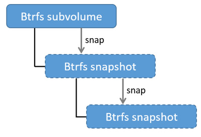

# btrfs storage driver
Btrfs是下一代**copy-on-write**文件系统。
它支持很多高级的存储技术，非常适合Docker。 
Btrfs已经进入内核。

Docker的**btrfs storage driver**利用了很多Btrfs的特性——**block-level operations**, **thin provisioning**, **copy-on-write snapshots**, 和**ease of administration**——进行镜像和容器的管理。
可以非常容易的将多个物理块设备合成一个Btrfs文件系统。

## Manager a Btrfs Volume
Btrfs的一个优点就是易于管理，不需要unmount文件系统，也不必重启Docker。
当空间变少的时候，Btrfs自动的扩展volumes，**in chunks of roughly 1 GB**。

增加一个块设备到volume：
* btrfs device add
* btrfs filesystem balance

```sh
$ sudo btrfs device add /dev/svdh /var/lib/docker
$ sudo btrfs filesystem balance /var/lib/docker
```

## How the btrfs storage driver works
**btrfs storage driver**和**devicemapper**以及其它的storage driver不同。
整个`/var/lib/docker/`目录都存储在Btrfs卷上，要求整个目录所处的文件系统都是Btrfs。

### Image and container layers on-disk
镜像的layers和容器的可写的layer的信息都存储在`/var/lib/docker/btrfs/subvolumes/`。每个镜像或者容器层都对应一个子目录，with the unified filesystem built from a layer plus all its parent layers。`Subvolumes`原生支持`copy-on-write`，并且可以从底层的存储池按需分配空间，也可以被嵌套和快照。
下图展示了4个subvolumes。
`Subvolume 2`和`Subvolume 3`是嵌套的，`Subvolume 4`显示了它自己的目录树。


对于一个镜像来说，只有最下一层被存储为一个subvolume。
其它的层都是snapshots，只包含差异信息。
可以创建snapshot的snapshot。



在磁盘上，snapshots看起来和subvolumes没什么不同，但实际上，snapshots非常小，并且效率高。 
`Copy-on-write`被用来最大化存储的效率，并最小化层的大小。
操作在block level。


为了提高效率，当容器需要更多空间时，它以chunk（1G）为单位分配空间。

Docker的btrfs storage driver把每个layer（镜像layer或者容器）都存在自己的subvolume或者snapshot。
镜像的base layer存储为subvolume；
镜像的其它层和容器层被存储为snapshots。
如下图示：


创建镜像和容器的流程大致如下：

1. 镜像的base layer存储为`/var/lib/docker/btrfs/subvolumes`中的一个subvolume。
2. 其他的image layers存储为父layer的Btrfs snapshot，只存差异信息，并且是在block level存储。
3. 容器的writable layer是最top的镜像layer的一个snapshot，同样只存差异信息，并且是在block level存储。

## How container reads and writes work with btrfs
### Reading files
容器是一个镜像的space-efficient snapshot。
`Snapshot`中的元数据指向存储池中的实际数据block。
`subvolume`也是如此。
从`snapshot`读数据和从`subvolume`读数据是一样的。

### Writing files
* **写入新文件**：Writing a new file to a container invokes an allocate-on-demand operation to allocate new data block to the container’s snapshot. The file is then written to this new space. The allocate-on-demand operation is native to all writes with Btrfs and is the same as writing new data to a subvolume. As a result, writing new files to a container’s snapshot operates at native Btrfs speeds.
* **修改已经存在的文件**：Updating an existing file in a container is a copy-on-write operation (redirect-on-write is the Btrfs terminology). The original data is read from the layer where the file currently exists, and only the modified blocks are written into the container’s writable layer. Next, the Btrfs driver updates the filesystem metadata in the snapshot to point to this new data. This behavior incurs very little overhead.
* **删除文件或者目录**：If a container deletes a file or directory that exists in a lower layer, Btrfs masks the existence of the file or directory in the lower layer. If a container creates a file and then deletes it, this operation is performed in the Btrfs filesystem itself and the space is reclaimed.

## Btrfs and Docker performance
Docker的性能会受到以下几个因素的影响：

* **Page caching**：Btrfs不支持page cache sharing。这就意味着每个要访问这个文件的进程，都要把文件拷贝到宿主机的内存中。因此，btrfs driver不适合高密度计算平台，比如PaaS。
* **Small writes**：容器进行大量的small writes或者短时间内start和stop大量的容器会can lead to poor use of Btrfs chunks。
* **Sequential writes**：Btrfs uses a journaling technique when writing to disk。这会影响顺序写的性能，损失性能50%。
* **Fragmentation**： 碎片化是copy-on-write filesystems的自然结果。 If your Linux kernel version is 3.9 or higher, you can enable the autodefrag feature when mounting a Btrfs volume. Test this feature on your own workloads before deploying it into production, as some tests have shown a negative impact on performance.
* **SSD performance**：Btrfs includes native optimizations for SSD media. To enable these features, mount the Btrfs filesystem with the -o ssd mount option. These optimizations include enhanced SSD write performance by avoiding optimization such as seek optimizations which do not apply to solid-state media.
* **Balance Btrfs filesystems often**：Use operating system utilities such as a cron job to balance the Btrfs filesystem regularly, during non-peak hours. This reclaims unallocated blocks and helps to prevent the filesystem from filling up unnecessarily. You cannot rebalance a totally full Btrfs filesystem unless you add additional physical block devices to the filesystem. See the BTRFS Wiki.
* **Use fast storage**：Solid-state drives (SSDs) provide faster reads and writes than spinning disks.
* **Use volumes for write-heavy workloads**：Volumes provide the best and most predictable performance for write-heavy workloads. This is because they bypass the storage driver and do not incur any of the potential overheads introduced by thin provisioning and copy-on-write. Volumes have other benefits, such as allowing you to share data among containers and persisting even when no running container is using them.