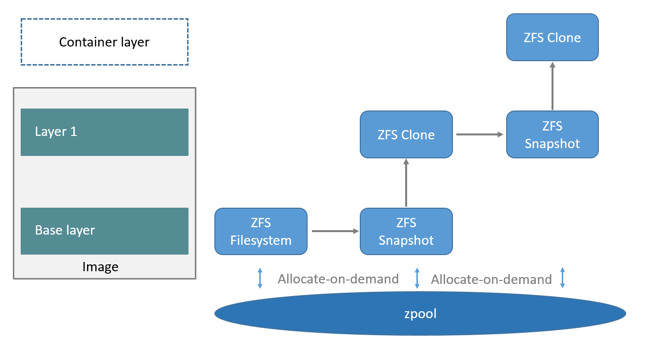

# ZFS storage driver
ZFS是下一代文件系统，支持很多高级存储技术：volume management，snapshots，checksumming, compression，deduplication，replication等。

ZFS文件系统由Sun开发（现在Oracle）。

ZFS on Linux(ZoL)已经很成熟。然而，仍然**不推荐**使用`zfs` storage driver作为生产环境使用，除非你在ZFS上有非常深刻的经验。

## How the zfs storage driver works
ZFS对象：
* filesystems: thinly provisioned, with space allocated from the zpool on demand.
* snapshots: read-only space-efficient point-in-time copies of filesystems.
* clones: Read-write copies of snapshots. Used for storing the differences from the previous layer.

一个clone的创建过程：

1. 从文件系统创建一个read-only的snapshot。
2. 从snapshot创建一个clone：clone中仅包含与parent layer中的差异。

Filesystems，snapshot和clones都是从underlying `zpool`分配空间。

### Image and container layers on-disk
每个运行着的容器的统一的文件系统都挂载在`/var/lib/docker/zfs/graph/`中的一个mount point上。

### Image layering and sharing

* 镜像的base layer是ZFS filesystem。
* Each child layer is a ZFS clone based on a ZFS snapshot of the layer below it。
* A container is a ZFS clone based on a ZFS Snapshot of the top layer of the image it’s created from.

在ZFS文件系统中，一个容器的启动过程如下：
1. The base layer of the image exists on the Docker host as a ZFS filesystem。
2. Additional image layers are clones of the dataset hosting the image layer directly below it.

In the diagram, “Layer 1” is added by taking a ZFS snapshot of the base layer and then creating a clone from that snapshot. The clone is writable and consumes space on-demand from the zpool. The snapshot is read-only, maintaining the base layer as an immutable object.

3. When the container is launched, a writable layer is added above the image.

In the diagram, the container’s read-write layer is created by making a snapshot of the top layer of the image (Layer 1) and creating a clone from that snapshot.

4. As the container modifies the contents of its writable layer, space is allocated for the blocks that are changed. By default, these blocks are 128k.

## How container reads and writes work with zfs
### Reading files
Each container’s writable layer is a ZFS clone which shares all its data with the dataset it was created from (the snapshots of its parent layers). Read operations are fasst, even if the data being read is from a deep layer. This diagram illustrates how block sharing works:

![pics/zpool_blocks.jpg]

### Writting files
* **Writing a new file**: space is allocated on demand from the underlying zpool and the blocks are written directly into the container’s writable layer.
* **Modifying an existing file**: space is allocated only for the changed blocks, and those blocks are written into the container’s writable layer using a copy-on-write (CoW) strategy. This minimizes the size of the layer and increases write performance.
* **Deleting a file or directory**:
    * When you delete a file or directory that exists in a lower layer, the ZFS driver masks the existence of the file or directory in the container’s writable layer, even though the file or directory still exists in the lower read-only layers.
    * If you create and then delete a file or directory within the container’s writable layer, the blocks are reclaimed by the zpool.
## ZFS and Docker performance
