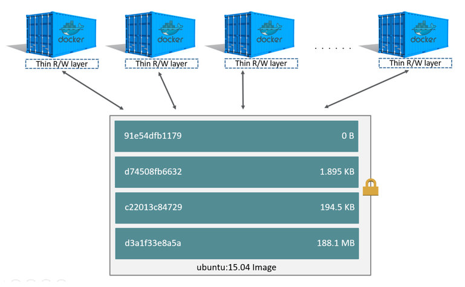
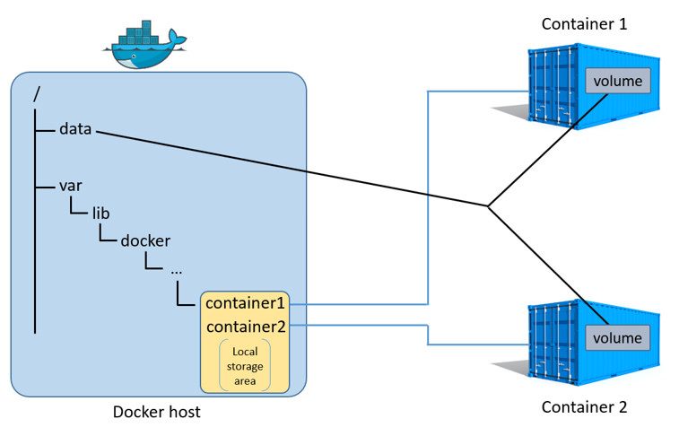

# Docker Storage Driver概述
理想情况下，几乎没有数据会直接写入容器的writable layer中。一般都是将数据写入volumes等持久存储。
但是也存在一些情况，需要向容器的writable layer写入数据，这就要用到`storage driver`。

Docker使用一系列不同的`storage driver`来管理镜像和容器中的文件系统。
Docker `storage drvier`和Docker Volumes不同。
Docker volumes管理的存储可以在多个容器中共享。

为了有效的使用storage driver，需要：
* 理解Docker如何构建（build）和存储（store）镜像（images）。
* 容器（container）如何使用镜像（images）。
* introduction to the technologies that enable both images and container operations。

## Images和layers
镜像是基于一系列的layers构建的。
每一个layer代表了Dockerfile中的一条指令。
除了最后一层，每一个layer都是只读（read-only）的。
比如下面这个：
```Dockerfile
FROM ubuntu:15.04
COPY . /app
RUN make /app
CMD python /app/app.py
```
这个Dockerfile包含四个命令，每个命令创建一个layer。
* `FROM`：以ubuntu:15.04构建一个base layer。
* `COPY`：把Docker client当前文件夹下的内容拷贝到/app中。
* `RUN`： 通过`make`命令编译应用。
* `CMD`： 最后一层指出容器运行时执行哪条命令。

每一层都只保存它和前一层的差异数据。**The layers are stacked on top of each other。**

当创建一个容器时，就在当前镜像上面（top of underlying layers）增加了一个writtable layer。
该层通常称为**container layer**。
容器中进行的所有更改：比如创建新的文件，修改文件，删除文件，都被写入这个**thin writable container layer**。


Docker `storage driver`就是具体处理**层与层之间的如何交互**的。

## Container and layers
容器和镜像的最大不同就是**top writable layer**。
容器的所有写入（增加文件、修改文件）都保存在**writable layer**。
当容器删除后，**writable layer**也随之删除。
底层的镜像层则保持不变。

每个容器都拥有自己的**writable container layer**，并且所有的变更都保存在**container layer**，
所以多个容器可以共享同样的底层镜像层的同时，拥有自己的状态。



Docker使用`storage driver`来管理镜像层和writable container layer的内容。
每个`storage driver`的实现不同，但是都使用**stackable image layers**和**copy-on-write (CoW)策略**。

## Container size on disk
要查看运行中的容器的size，可以通过命令行`docker ps -s`，该命令的输出中，有两个field与size相关：
* size：容器的writable layer的size。
* virtual size：writable layer和read-only的镜像层的size之和。多个容器或许共享一些或者全部read-only的image data。

## The copy-on-write (CoW) strategy
Copy-on-write是一种`共享和复制`策略，为了实现效率最大化。
如果一个文件或者目录在镜像的低层存在，另一个层要访问这个文件，该层只是利用底层存在的这个文件；
当要第一次修改这个文件时，才把这个文件从低层拷贝到当前层。
如此可以最小化I/O操作，并且使每层都保持一个很小的size。
### Sharing promotes smaller images
### Copying makes containers efficient

## Data volumes and the storage driver
如果一个容器被删除，所有写入容器中的数据——除了存储在`Data Volume`中的——都会随着容器一起删除。

一个`data volume`是Docker宿主机文件系统中的一个文件或者目录：直接mount到容器中。
`Data volumes`不是由`storage driver`控制的。
对`data volumes`的读和写都越过（bypass）storage driver，能够达到native host speed。
可以对一个容器mount任意多的`data volume`。
多个容器可以共享`data volumes`。如下图：



`Data volumes`可以存在Docker Host的本地storage area（/var/lib/docker）之外，进一步增强了独立性，不受storage driver控制。
当一个容器删除的时候，存储在data volumes中的数据持久化在宿主机上。