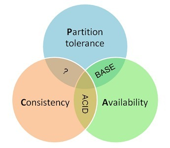

# 分布式系统的CAP理论
2000年7月，加州大学伯克利分校的Eric Brewer教授在ACM PODC会议上提出CAP猜想。

2年后，麻省理工学院的Seth Gilbert和Nancy Lynch从理论上证明了CAP。之后，CAP理论正式成为分布式计算领域的公认定理。

## CAP理论概述

一个分布式系统最多只能同时满足***一致性、可用性和分区容错性**这三项中的两项。

## CAP定义
### 一致性（Consistency）
一致性指“all nodes see the same data at the same time”，即更新操作成功并返回给客户端完成后，所有节点在同一时间的数据完全一致。

对于一致性，可以从**客户端**和**服务端**两个不同的视角来研究：

* 从客户端来看，一致性主要指的是多并发访问时，更新过的数据如何获取的问题。
* 从服务端来看，一致性主要指的是更新操作如何复制到整个分布式系统，以保证数据的最终一致。

一致性是因为有并发读写才有问题，因此在理解一致性问题时，一定要注意结合考虑并发读写的场景。

从客户端角度，多进程并发访问时，更新过的数据在不同进程如何获取的策略，决定了不同的一致性。

* 对于关系型数据库，要求更新过的数据能被后续的访问都能看到，这是**强一致性**。
* 如果能容忍后续的部分或者全部访问不到，则是**弱一致性**。
* 如果经过一段时间后要求能访问到更新后的数据，则是**最终一致性**。

### 可用性（Availability）
可用性指“Reads and writes always succeed”，即服务一直可用，而且是正常响应时间。

对于一个可用性的分布式系统，每一个非故障的节点必须对每一个请求作出响应。也就是，该系统使用的任何算法必须最终终止。

当同时要求分区容错性时，这是一个很强的定义：即使是严重的网络错误，每个请求也必须终止。

**好的可用性主要是指系统能够很好的为用户服务，不出现用户操作失败或者访问超时等用户体验不好的情况**。

可用性通常情况下和**分布式数据冗余**，**负载均衡**等有着很大的关联。

### 分区容错性（Partition tolerance）
分区容错性指“the system continues to operate despite arbitrary message loss or failure of part of the system”，即分布式系统在遇到某节点或网络分区故障的时候，仍然能够对外提供满足**一致性**和**可用性**的服务。

分区容错性和扩展性紧密相关。在分布式应用中，可能因为一些分布式的原因导致系统无法正常运转。

**好的分区容错性要求：应用虽然是一个分布式系统，而看上去却好像是在一个可以运转正常的整体**。
比如现在的分布式系统中有某一个或者几个机器宕掉了，其他剩下的机器还能够正常运转满足系统需求，或者是机器之间有网络异常，将分布式系统分隔成独立的几个部分，各个部分还能维持分布式系统的运作，这样就具有好的分区容错性。

## CAP证明

如上图，是我们证明CAP的基本场景，网络中有两个节点N1和N2，可以简单的理解N1和N2分别是两台计算机，他们之间网络可以连通。
N1中有一个应用程序A，和一个数据库V，N2也有一个应用程序B2和一个数据库V。
现在，A和B是分布式系统的两个部分，V是分布式系统的数据存储的两个子数据库。

在满足一致性的时候，N1和N2中的数据是一样的，V0=V0。

在满足可用性的时候，用户不管是请求N1或者N2，都会得到立即响应。

在满足分区容错性的情况下，N1和N2有任何一方宕机，或者网络不通的时候，都不会影响N1和N2彼此之间的正常运作。

如上图，是分布式系统正常运转的流程，用户向N1机器请求数据更新，程序A更新数据库V0为V1，分布式系统对数据进行同步操作M，将V1同步的N2中V0，使得N2中的数据V0也更新为V1，N2中的数据再响应N2的请求。

* N1和N2的数据库V之间的数据是否一样为**一致性**。
* 外部对N1和N2的请求响应为**可用行**。
* N1和N2之间的网络环境为**分区容错性**。

这是正常运作的场景，也是理想的场景，然而现实是残酷的，当错误发生的时候，一致性和可用性还有分区容错性，是否能同时满足，还是说要进行取舍呢？

作为一个分布式系统，它和单机系统的最大区别，就在于网络，现在假设一种极端情况，N1和N2之间的网络断开了，我们要支持这种网络异常，相当于要满足分区容错性，能不能同时满足一致性和响应性呢？还是说要对他们进行取舍。

假设在N1和N2之间网络断开的时候，有用户向N1发送数据更新请求，那N1中的数据V0将被更新为V1。由于网络是断开的，所以分布式系统同步操作M无法进行，从而导致N2中的数据依旧是V0。
这个时候，有用户向N2发送数据读取请求，由于数据还没有进行同步，应用程序没办法立即给用户返回最新的数据V1，怎么办呢？有二种选择：

1. 牺牲数据一致性，响应旧的数据V0给用户。
2. 牺牲可用性，阻塞等待，直到网络连接恢复，数据更新操作M完成之后，再给用户响应最新的数据V1。

这个过程，证明了**要满足分区容错性的分布式系统**，只能在**一致性和可用性**两者中，选择其中一个。

## CAP权衡

通过CAP理论，我们知道无法同时满足一致性、可用性和分区容错性这三个特性，那要舍弃哪个呢？

* CA without P：如果不要求P（不允许分区），则C（强一致性）和A（可用性）是可以保证的。但其实分区不是你想不想的问题，而是始终会存在，因此CA的系统更多的是允许分区后各子系统依然保持CA。

* CP without A：如果不要求A（可用），相当于每个请求都需要在Server之间强一致，而P（分区）会导致同步时间无限延长，如此CP也是可以保证的。**很多传统的数据库分布式事务都属于这种模式**。

* AP wihtout C：要高可用并允许分区，则需放弃一致性。一旦分区发生，节点之间可能会失去联系，为了高可用，每个节点只能用本地数据提供服务，而这样会导致全局数据的不一致性。**现在众多的NoSQL都属于此类**。

对于多数大型互联网应用的场景，主机众多、部署分散，而且现在的集群规模越来越大，所以节点故障、网络故障是常态，而且要保证服务可用性达到N个9。
这是保证P和A，舍弃C（退而求其次保证最终一致性）。
虽然某些地方会影响客户体验，但没达到阻碍用户流程的严重程度。

对于涉及到钱财的系统，不能有一丝让步的场景，C必须保证。网络发生故障宁可停止服务。
这是保证CA，舍弃P。
还有一种是保证CP，舍弃A。例如网络故障时只读不写。