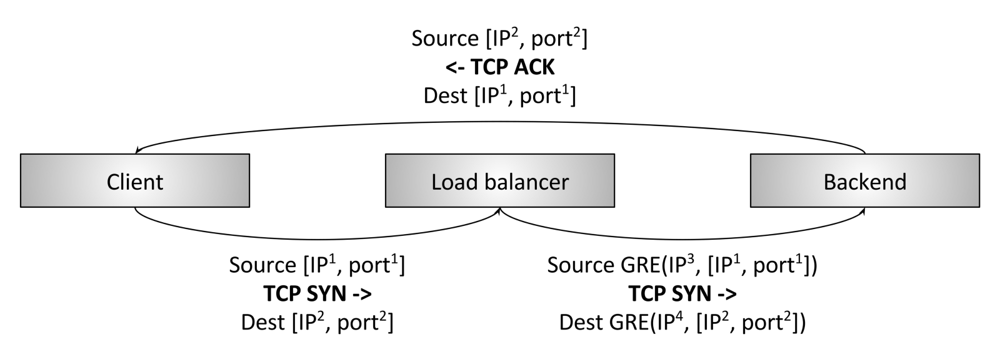

# 四层负载均衡
在**edge deployment**中，通常把一个**专用的L4负载均衡器**置于L7负载均衡器之前：
* 由于L7负载均衡器需要执行更多的分析、转换和应用流量的路由，与L4相比，L7只能处理相对一部分原始流量（packets/second、bytes/second）。同时，使用L4处理某种类型的DoS攻击（比如SYN floods，generic packet flood attacks）更有效。
* L7负载均衡器没有L4负载均衡器稳定（相对地）。

## TCP/UDP termination load balancers

Figure 8: L4 termination load balancer

两条独立的TCP连接：
* 客户端和负载均衡器之间；
* 均衡器和backend之间。

## TCP/UDP passthrough load balancers

Figure 9: L4 passthrough load balancer

在这种类型的负载均衡中，客户端发起的TCP连接没有被loadbalancer终止，相反，连接上的packets通过**connection tracking**和**NAT**被转发到被选中的某个后端。
* Connection tracking: Is the process of keeping track of the state of all active TCP connections. This includes data such as whether the handshake has completed, whether a FIN has been received, how long the connection has been idle, which backend has been selected for the connection, etc.
* NAT: NAT is the process of using connection tracking data to alter IP/port information of packets as they traverse the load balancer.

使用**connection tracking**和**NAT**，四层负载均衡器可以将大部分原始TCP流量从client **passthrough**到backend。

## Direct server return (DSR)

Figure 10: L4 Direct server return (DSR)

DSR构建在**passthrough load balancer**之上。对于DSR，只有ingress/request流量经过load balancer；Egress/response流量不经过load balancer。

* The load balancer still typically performs partial connection tracking. Since response packets do not traverse the load balancer, the load balancer will not be aware of the complete TCP connection state. However, the load balancer can strongly infer the state by looking at the client packets and using various types of idle timeouts.
* Instead of NAT, the load balancer will typically use Generic Routing Encapsulation (GRE) to encapsulate the IP packets being sent from the load balancer to the backend. Thus, when the backend receives the encapsulated packet, it can decapsulate it and know the original IP address and TCP port of the client. This allows the backend to respond directly to the client without the response packets flowing through the load balancer.
* An important part of the DSR load balancer is that the backend participates in the load balancing. The backend needs to have a properly configured GRE tunnel and depending on the low level details of the network setup may need its own connection tracking, NAT, etc.

## Fault tolerance via high availability pairs

Figure 11: L4 fault tolerance via HA pairs and connection tracking

## Fault tolerance and scaling via clusters with **distributed consistent hashing**

Figure 12: L4 fault tolerance and scaling via clustered load balancers and consistent hashing
