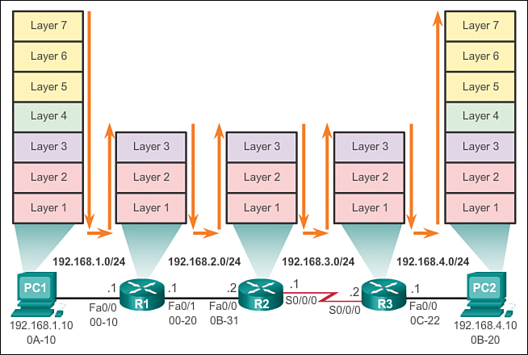

# 路由
以太网交换机工作在第二层即数据链路层，用于在同一网络内部转发以太网帧。

但是，当源和目的IP地址位于不同网络时，以太网帧必须发送给路由器。

路由器负责在不同网络间传输报文，通过路由表来决定最佳转发路径。当主机将报文发送至不同IP地址时，由于主机无法直接与本地网络以外的设备通信，报文被转发至***默认网关***。***默认网关***就是数据流从本地网络路由至远端设备的目的地。它通常用来连接***本地网与公共网***。

## 报文转发过程
路由器在一个接口接收报文并将它从另一个接口转发出去，这一过程的关键步骤是为输出链路将报文封装在适当的数据链路帧中。

路由器主要执行以下三个步骤：

1. 将第二层的帧头和帧尾移除，解析出第三层报文。
1. 检查IP报文的目的IP地址，在路由表中查找最佳路由。
1. 如果路由器找到一条最佳路径，则将三层报文封装到新的二层帧中，并将帧转发到输出端口。

如下图所示：

设备有三层IPv4地址，以太网接口有二层数据链路地址。例如PC 1的IPv4地址192.168.1.10，示例MAC地址0A-10。在报文从原设备传输至目的设备的过程中，三层IP地址不会改变。但是，每一跳随着报文在路由器中被解封装和重新封装，二层数据链路地址都会改变。很可能报文被封装成与接收时不同的另一种类型的二层帧。

## 发送报文

PC1发送报文给PC2时，首先必须确定***目的IPv4地址是否位于同一网络***。

PC1通过将自己的IPv4地址与子网掩码做与操作，来判断PC1所属的网段。接下来，PC1对目的IPv4地址与PC1的子网掩码做同样的与操作。

如果目的网络地址与PC1网络相同，则PC1不使用默认网关，而是在***ARP缓存***中查找目的IPv4地址的设备MAC地址。如果MAC地址不在缓存中，则PC1产生一个ARP请求来获取地址并将报文发给目的地址。

如果目的网络地址位于另一网络，则PC1将报文转发至默认网关。
要确定默认网关的MAC地址，PC1在它的ARP表中查找默认网关的IPv4地址以及相应的MAC地址。如果ARP表中没有默认网关的对应表项，则PC1发送ARP请求。路由器R1回复ARP响应。之后PC1将报文转发至默认网关的MAC地址，即路由器R1的Fa0/0接口。

## 转发至下一跳

R1从PC1接收到以太网帧后执行以下步骤：

1. R1检查目的MAC地址，与接收端口FastEthernet 0/0相匹配，因此，将帧复制到buffer。
1. R1识别以太网类型为0x800，意味着以太网帧的数据部分包含IPv4报文。
1. R1解封装该以太网帧。
1. ***由于目的IPv4地址与R1直连的任何网络都不相符***，R1在路由表中查找包含该目的IPv4地址主机的网络地址。本例中，路由表中有192.168.4.0/24网络的路由。目的IPv4地址为192.168.4.10，即该网络上的主机IPv4地址。

R1找到192.168.4.0/24路由的下一条IPv4地址为192.168.2.2以及输出端口FastEthernet 0/1，这意味着IPv4报文封装到一个新的以太网帧中，目标MAC地址是下一跳路由器的MAC地址。

由于下一个接口是在以太网上，所以R1必须用ARP解析出下一跳IPv4地址的MAC地址。

1. R1在ARP cache中查找下一跳IPv4地址192.168.2.2。如果表项不在ARP cache中，R1会从FastEthernet 0/1 接口发送ARP请求，R2会返回ARP响应。R1之后在ARP cache中更新192.168.2.2的MAC地址。
1. IPv4报文封装到新的以太网帧中并从R1的FastEthernet 0/1 接口转发出去。

##  到达目的地
当帧到达R3时执行以下步骤：

1. R3将数据链路帧复制到它的buffer。
1. R3解封装该数据链路帧。
1. R3在路由表中查找该目的IPv4地址。R3路由表中有直接连接到该网络的路由。这表示报文可直接发送到目的设备而无需发送至路由器。

由于输出接口是一个直连以太网，所以R3必须用ARP解析出目的IPv4地址的MAC地址。

1. R3在它的ARP cache中查找目的IPv4地址，如果此ARP cache中没有此表项，R3会从FastEthernet 0/0 接口发送ARP请求。PC2回复ARP响应告知它的MAC地址。R3之后在ARP cache中更新192.168.4.10的MAC地址。
1. IPv4报文封装到新的以太网帧中并从R3的FastEthernet 0/0 接口发出。
1. 当PC2接收到该帧，检查帧的目的MAC地址，与网卡接收端口的MAC地址相匹配，PC2于是将帧的剩余部分复制到自己的buffer。
1. PC2识别到以太网类型为0x800，也就是帧的数据部分包含IPv4报文。
1. PC2解封装以太网帧，将IPv4报文传递给操作系统的IPv4进程。

## 路由表
路由表存储的信息包括：

* 直连路径：来自活动路由接口的路径。当接口为活动状态并配置了IP地址时，路由器添加一条直连路径。
* 远端路径：远端的网络连接到其他路由。通过静态配置或动态路由协议到达该网络。

路由表是存储在RAM中的一份数据文件，用于存储直连以及远端网络的路由信息。

路由表中包含网络或下一跳地址的信息。这些信息告知路由器可以通过将报文发送至代表下一跳地址的路由器以最佳路径到达目的地址。下一跳信息也可以是到下一个目的地的输出接口。

## 路由表内容：
Cisco IOS路由器可用show IP route命令显示IPv4路由表。

路由器还提供一些额外的路由信息，包括路径是怎样学习到的，路径在表中有多长时间，使用哪一接口去到达预定义的目的地。
路由表中的表项可作为以下内容添加：

* 本地路径接口：当接口配置并激活时添加。
* 直连接口：当接口配置并激活时添加。
* 静态路径：当手动配置路径并且输出接口激活时。
* 动态路由协议：当路由协议动态学习到网络时添加，如EIGRP或OSPF。
路由表项的来源通过代码来标识，代码表明路径是怎样学习到的。例如，常用代码包括：

* L：路由器接口地址。当路由器接收到报文时发送至本地接口而无需转发。
* C：直连网段。
* O：通过OSPF从另一个路由器动态学习到的网络。
* D：通过EIGRP从另一个路由器动态学习到的网络。

## 静态路由
静态路由是指由网络管理员手工配置的路由信息。当网络的拓扑结构或链路的状态发生变化时，网络管理员需要手工去修改路由表中相关的静态路由信息。

对于特定的目标地址，以及在小型或稳定的网络环境，手动配置静态路由可以非常成功地应用。通过使用静态路由，网络管理员确定了通向一目标网络的路径。

## 动态路由

对于特定的目标地址，以及在小型或稳定的网络环境，手动配置静态路由可以非常成功地应用。通过使用静态路由，网络管理员确定了通向一目标网络的路径。

路由协议允许路由器动态共享远端网络的信息以及自动将这信息添加到自己的路由表中。动态路由协议的一大好处在于当拓扑变更时，路由器会交换路由信息，从而能够自动学习新增网络，并且在链路故障时，找到替换路径。

路由协议完成这一功能的方式取决于它所使用的算法以及此协议的操作特性。

