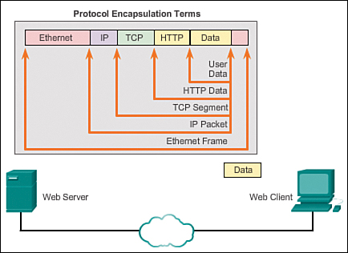
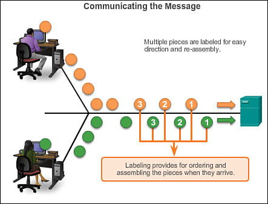
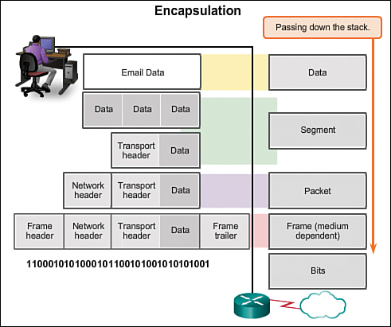
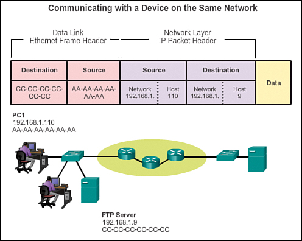
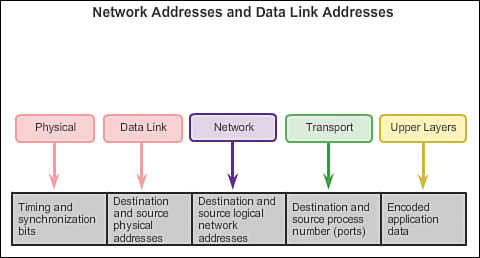
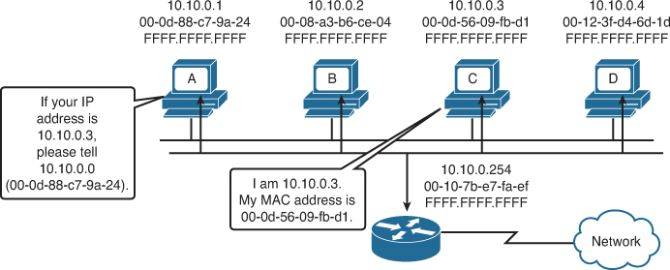
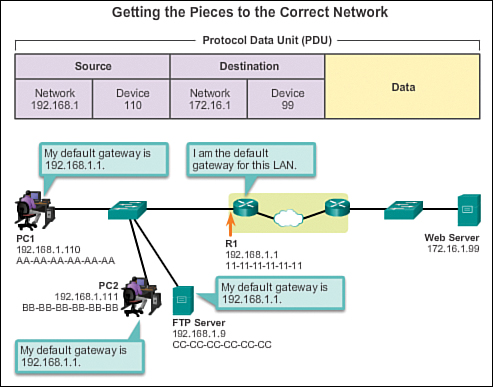
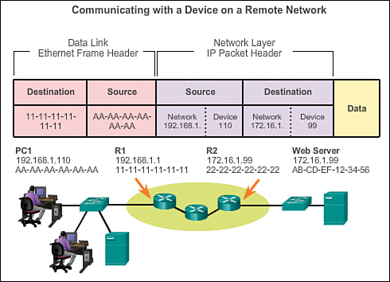

# 网络传输

## 首先来看一个例子
在详细阐述网络传输过程之前，先来看一个最常见的例子，下图显示了一个网络服务器向客户端传送数据的完整过程：

 1\. 需要传送的数据是网络服务器的HTML页面。

 2\. 应用协议HTTP报文头添加到HTML数据之前。
 
 报文头信息包括：服务器所使用的HTTP版本，以及表明它发给网络客户端信息的状态编码。

 3\. HTTP应用层协议将HTML格式的网页数据发送给传输层。
 
 TCP传输层用于管理网络服务器和客户端之间的会话。

 4\. IP信息添加到TCP信息之前。
 
 IP指定适当的源和目的IP地址。这些信息就构成了IP报文。

 5\. 以太网协议添加到IP报文的两端之后，就形成了数据链路帧。
 
上述帧发送至通向网络客户端的路径上的最近一个路由器。路由器移除以太网信息，观察IP报文，判定最佳路径，将报文插入一个新的帧，并发送至目标路径上下一个相邻路由器。每一个路由器在转发之前都移除并添加新的数据链路层信息。

 6\. 数据通过互联网络传输，互联网络包含媒介和中间设备。

 7\. 客户端接收到包含数据的数据链路帧，处理各层协议头，之后以添加时相反的顺序移除协议头。
 
 首先处理并移除以太网信息，之后是IP协议信息，接下来TCP信息，最后是HTTP信息。

 8\. 之后，将网页信息传递给客户端网页浏览器软件。

## 数据封装
消息要在网络中传输，必须对它进行编码，以特定的格式进行封装，同时需要适当地封装以足够的***控制和地址信息***，以使它能够从发送方移动到接收方。

## 消息大小

理论上，视频或邮件信息是能够以***大块非中断型流***从网络源地址传送到目的地址，但这也意味着同一时刻同一网络其他设备就无法收发消息。这种大型数据流会造成显著延时。并且，如果传输过程中连接断开，整个数据流都会丢失需要全部重传。

因此更好的方法是将数据流分割（segmentation）为较小的，便于管理的片段，能够带来两点好处：

* 发送较小片段，网络上同时可有多个会话交错进行。这种在网络上将不同会话片段交错进行的过程称为多路传输（multiplexing）。
* 分割可提高网络通讯的可靠性。各消息片段从源地址到目的地址无需经过相同路径，如果一条路径被堵塞或断开，其余消息可从替换路径到达目的地址。如果部分消息到不了目的地址，那只需重传丢失部分。

通过对片段打上标签的方式来保证顺序以及在接收时重组。

## 协议数据单元（Protocol Data Unit, PDU）
应用层数据在传输过程中沿着协议栈传递，每一层协议都会向其中添加信息。这就是封装的过程。
数据片段在各层网络结构中采用的形式就称为协议数据单元（PDU）。

封装过程中，下一层对从上一层收到的PDU进行封装。在处理的每一个阶段PDU都有不同的名字来反应它的功能。

PDU按照TCP/IP协议的命名规范：

* 数据（Data）：应用层PDU的常用术语
* 分段（Segment）：传输层PDU
* IP分组 (Packet)：网络层PDU
* 帧（Frame）：网络层PDU
* 比特（Bits）：在介质上物理传输数据所使用的PDU。

## 封装

封装是指在传输之前为数据添加额外的协议头信息的过程。

在绝大多数数据通信过程中，源数据在传输前都会封装以数层协议。

在网络上发送消息时，主机上的协议栈从上至下进行操作。

以网络服务器为例，HTTP应用层协议发送HTML格式网页数据到传输层，应用层数据被分成TCP分段。各TCP分段被打上标签，称为头（header），表明接收方哪一个进程应当接收此消息。同时也包含使得接收方能够按照原有的格式来重组数据的信息。

传输层将网页HTML数据封装成分段并发送至网络层，执行IP层协议。整个TCP分段封装成IP报文，也就是再添上IP头标签。IP头包括源和目的IP地址，以及发送报文到目的地址所必须的信息。

之后，IP报文发送到接入层，封装以帧头和帧尾。每个帧头都包含源和目的物理地址。物理地址唯一指定了本地网络上的设备。帧尾包含差错校正信息。

最后，由服务器网卡将比特编码传输给介质。

## 解封装

接收主机以相反的方式进行操作称为解封装。

解封装是接收设备移除一层或多层协议头的过程。数据在协议栈中向上移动直到终端应用层伴随着解封装。

## 访问本地资源
访问本地网络资源需要两种类型的地址：***网络层地址和数据链路层地址***。

网络层和数据链路层负责将数据从发送设备传输至接收设备。两层协议都有源和目的地址，但两种地址的目的不同。

示例：客户端PC1与FTP在同一IP网络的通信

### 网络地址

网络层地址或IP地址包含两个部分：网络前缀和主机。

路由器使用网络前缀部分将报文转发给适当的网络。

最后一个路由器使用主机部分将报文发送给目标设备。

同一本地网络中，网络前缀部分是相同的，只有主机设备地址部分不同。

* 源IP地址：发送设备，即客户端PC1的IP地址：192.168.1.110
* 目的IP地址：接收设备，即FTP服务器：192.168.1.9

### 数据链路地址
数据链路地址的目的是在同一网络中将数据链路帧从一个网络接口发送至另一个网络接口。

以太网LAN和无线网LAN是两种不同物理介质的网络示例，分别有自己的数据链路协议。

当IP报文的发送方和接收方位于同一网络，数据链路帧直接发送到接收设备。

以太网上数据链路地址就是以太网MAC地址。MAC地址是物理植入网卡的48比特地址。

* 源MAC地址：发送IP报文的PC1以太网卡MAC地址，AA-AA-AA-AA-AA-AA。
* 目的MAC地址：当发送设备与接收设备位于同一网络，即为接收设备的数据链路地址。本例中，FTP MAC地址：CC-CC-CC-CC-CC-CC。

源和目的MAC地址添加到以太网帧中

### MAC与IP地址
发送方必须知道接收方的物理和逻辑地址。发送方主机能够以多种方式学习到接收方的IP地址：比如域名系统（Domain Name System, DNS），或通过应用手动输入，如用户指定FTP地址。

以太网MAC地址是怎么识别的呢？发送方主机使用地址解析协议（Address Resolution Protocol, ARP）以检测本地网络的所有MAC地址。

如下图所示，发送主机在整个LAN发送ARP请求消息，这是一条广播消息。ARP请求包含目标设备的IP地址，LAN上的每一个设备都会检查该ARP请求，看看是否包含它自身的IP地址。只有符合该IP地址的设备才会发送ARP响应。ARP响应包含ARP请求中IP地址相对应的MAC地址。

## 访问远程资源：

### 默认网关

当主机发送消息到远端网络，必须使用路由器，也称为默认网关。

默认网关就是位于发送主机同一网络上的路由器的接口IP地址。有一点很重要：本地网络上的所有主机都能够配置自己的默认网关地址。如果该主机的TCP/IP设置中没有配置默认网关地址，或指定了错误的默认网关地址，则远端网络消息无法被送达。

如下图所示，LAN上的主机PC 1使用IP地址为192.168.1.1的R1作为默认网关，如果PDU的目的地址位于另一个网络，则主机将PDU发送至路由器上的默认网关。

### 与远端网络设备通讯
下图显示了客户端主机PC 1与远端IP网络服务器进行通讯的网络层地址与数据链路层地址：

### 网络地址

当报文的发送方与接收方位于不同网络，源和目的IP地址将会代表不同网络上的主机。

* 源IP地址：发送设备即客户端主机PC 1的IP地址：192.168.1.110。
* 目的IP地址：接收设备即网络服务器的IP地址：172.16.1.99。

### 数据链路地址
当报文的发送方与接收方位于不同网络，以太网数据链路帧无法直接被发送到目的主机。

以太网帧必须先发送给路由器或默认网关。本例中，默认网关是R1，R1的接口IP地址与PC 1属于同一网络，因此PC 1能够直接达到路由器。

* 源MAC地址：发送设备即PC 1的MAC地址，PC1的以太网接口MAC地址为：AA-AA-AA-AA-AA-AA。
* 目的MAC地址：当报文的发送方与接收方位于不同网络，这一值为路由器或默认网关的以太网MAC地址。

本例中，即R1的以太网接口MAC地址，即：11-11-11-11-11-11。
IP报文封装成的以太网帧先被传输至R1，R1再转发给目的地址即网络服务器。R1可以转发给另一个路由器，如果目的服务器所在网路连接至R1，则直接发送给服务器。

发送设备如何确定路由器的MAC地址？每一个设备通过自己的TCP/IP设置中的默认网关地址得知路由器的IP地址。之后，它通过ARP来得知默认网关的MAC地址，该MAC地址随后添加到帧中。

## 参考链接
https://wizardforcel.gitbooks.io/network-basic/content/0.html