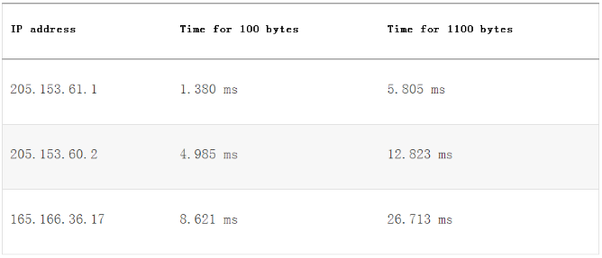

# 网络性能检测：带宽测量

网络路径性能检测主要包括三方面的内容：

* **带宽测量**能够获知网络的硬件特性，如网络的最大容量。
* **吞吐量测量**能够获得网络实际可提供的最大容量。
* **数据流测量**能够了解真实占用的网络容量。

本文介绍在评估网络性能是否合理时，需要收集的数据及收集方式。

涉及工具包括：ping, pathchar, bing, ttcp, netperf, iperf, netstat。

## 带宽测量

### PING
ping这一工具返回的时间，虽然通常被描述为传输延时，实际上是**发送，传输，队列延时之和**。

[PING](bn010.md)中，我们通过ping来粗略计算带宽。

这一过程可通过如下方式改进：***首先计算链路近端的路径行为，然后计算远端路径，然后用两者差异来估算链路带宽***。

这一过程需要四次使用ping。

1. 首先，用两个不同大小报文ping近端链路。减掉传输大报文中额外数据的传输时间以外，时间差可估算传输以及队列延时。
2. 接下来，用同样两个报文ping远端链路。再次用大报文和小报文的时间差来估算开销。最后，用两次差值的差值就是在最后一段链路中传输额外数据的时间值。
3. 这是一个往返时间，除以2就是额外数据在单向链路传输所用时间。带宽则是额外数据总量除以单向传输时间。

下表是第二跳和第三跳的时间值，报文大小为100和1100字节。

下表显示了带宽计算结果，用time difference除以2，用8000bit除以这个值，再乘1000（毫秒转换为秒）。结果是bps转换为Mbps。

计算过程：

* (12.823-4.985) - (5.805-1.380) = 3.413
* (26.713-8.621）- (12.823-4.985) = 10.254

### pathchar
将上述过程自动话完成的一个工具是pathchar。pathchar在路径的一端即能检测各链路的带宽。方法与之前描述的ping相类似，但是pathchar使用各种大小不一的报文。
如下例所示：

	$pathchar 165.166.0.2
	pathchar to 165.166.0.2 (165.166.0.2)
	mtu limited to 1500 bytes at local host
	doing 32 probes at each of 45 sizes (64 to 1500 by 32)
	0 205.153.60.247 (205.153.60.247)
	|   4.3 Mb/s,   1.55 ms (5.88 ms)
	1 cisco (205.153.60.2)
	|   1.5 Mb/s,   -144 us (13.5 ms)
	2 165.166.36.17 (165.166.36.17)
	|    10 Mb/s,   242 us (15.2 ms)
	3 e0.r01.ia-gnwd.Infoave.Net (165.166.36.33)
	|   1.2 Mb/s,   3.86 ms (32.7 ms)
	4 165.166.125.165 (165.166.125.165)
	|   ?? b/s,   2.56 ms (37.7 ms)
	5 165.166.125.106 (165.166.125.106)
	|    45 Mb/s,   1.85 ms (41.6 ms),  +q 3.20 ms (18.1 KB) *4
	6 atm1-0-5.r01.ncchrl.infoave.net (165.166.126.1)
	|    17 Mb/s,   0.94 ms (44.3 ms),  +q 5.83 ms (12.1 KB) *2
	7 h10-1-0.r01.ia-chrl.infoave.net (165.166.125.33)
	|   ?? b/s,   89 us (44.3 ms),  1% dropped
	8 dns1.InfoAve.Net (165.166.0.2)
	8 hops, rtt 21.9 ms (44.3 ms), bottleneck 1.2 Mb/s, pipe 10372 bytes

pathchar的运行过程中，首先显示的信息描述探测如何进行。从第三行输出开始，可看到pathchar使用从64到1500字节的45中不同大小报文。对于每一跳使用32种不同报文组合进行测试。因此，共8跳生成了11，520个测试报文加上相应回复信息。

显示中给出了带宽和延时。pathchar也包括了队列延时信息（如本例中5和6）。如上述信息，pathchar并不总是能成功估算出带宽（如链路4和7）或是延时（如链路1）。

在pathchar运行过程中，每发送一个报文就启动一次倒计时：显示内容如下所示：

	1:  31   288   0       3

* 1指示跳数并且随着路径上后续跳数而增加。
* 下一个数字是倒计时值，给出这一链路剩余的探测组数。
* 第三个值是当前发送报文大小。第二个和第三个值改变都非常迅速。
* 倒数第二个值是目前为止丢弃报文数，最后一个是该链路的平均往返时间。

当一条的探测完成时，这一行内容被带宽，传输延时，往返时间所取代。
pathchar使用观测到的最小延时来改进带宽估算值。

### BING
pathchar的一个替代工具是bing。

***pathchar估算的是一条路径上各链路的带宽***，而***bing用来测量点到点的带宽***。

通常，如果你不知道路径上的各条链路，需要首先执行traceroute命令。之后可以运行bing来指定链路的近端和远端。

下例显示了第三跳的带宽：

	$bing -e10 -c1 205.153.60.2 165.166.36.17
	BING    205.153.60.2 (205.153.60.2) and 165.166.36.17 (165.166.36.17)
	        44 and 108 data bytes
	1024 bits in 0.835ms: 1226347bps, 0.000815ms per bit
	1024 bits in 0.671ms: 1526080bps, 0.000655ms per bit
	1024 bits in 0.664ms: 1542169bps, 0.000648ms per bit
	1024 bits in 0.658ms: 1556231bps, 0.000643ms per bit
	1024 bits in 0.627ms: 1633174bps, 0.000612ms per bit
	1024 bits in 0.682ms: 1501466bps, 0.000666ms per bit
	1024 bits in 0.685ms: 1494891bps, 0.000669ms per bit
	1024 bits in 0.605ms: 1692562bps, 0.000591ms per bit
	1024 bits in 0.618ms: 1656958bps, 0.000604ms per bit
	--- 205.153.60.2 statistics ---
	bytes   out    in   dup  loss   rtt (ms): min       avg       max
	   44    10    10          0%           3.385     3.421     3.551
	  108    10    10          0%           3.638     3.684     3.762
	--- 165.166.36.17 statistics ---
	bytes   out    in   dup  loss   rtt (ms): min       avg       max
	   44    10    10          0%           3.926     3.986     4.050
	  108    10    10          0%           4.797     4.918     4.986
	--- estimated link characteristics ---
	estimated throughput 1656958bps
	minimum delay per packet 0.116ms (192 bits)
	average statistics (experimental) :
	packet loss: small 0%, big 0%, total 0%
	average throughput 1528358bps
	average delay per packet 0.140ms (232 bits)
	weighted average throughput 1528358bps
	resetting after 10 samples.
输出从地址和报文大小信息开始，之后是探测pair。接下来，返回往返时间和丢失数据。最后，返回一些吞吐量的估测值。