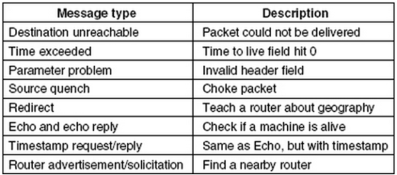
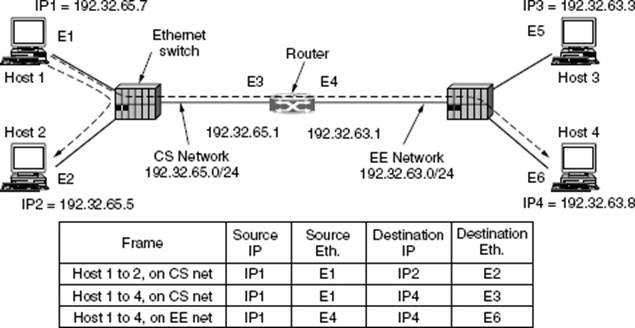

# ICMP与ARP

ICMP是网络控制消息协议，主要用于传递查询报文与差错报文。

ARP是地址解析协议，它的作用是在以太网环境下，通过3层的IP地址来找寻2层的MAC地址，得到一张ARP缓存表。转发数据的时候根据ARP缓存表来进行传输。

## ICMP
Internet操作是由路由器严密监控的。当路由器端处理报文时如有意外发生，事件通过ICMP报告给发送端。ICMP也用来测试Internet。ICMP信息封装在IP报文中，最重要的一部分如下表所列：

* **DESTINATION UNREACHABLE**消息用于当路由器无法找到目标地址或当设置了DF位的报文无法递送，因为路径上存在“小报文”网络。
* **TIME EXCEEDED**消息是由于报文TTL（Time to live）计数器到达0时。该事件是报文在回环，或计数器值设置过低的迹象。对于这一错误信息的聪明的应用是traceroute工具，traceroute发现从主机到目的IP地址路径上的路由器。它向目的地发送IP包，第一次的时候，将TTL设置为1，引发第一个路由器的Time Exceeded错误。这样，第一个路由器回复ICMP包，从而让出发主机知道途径的第一个路由器的信息。随后TTL被设置为2、3、4，...，直到到达目的主机。这样，沿途的每个路由器都会向出发主机发送ICMP包来汇报错误。traceroute将ICMP包的信息打印在屏幕上，就是接力路径的信息了。这并不是TIME EXCEEDED信息的本意，但却是非常有用的故障排查工具。
* **PARAMETER PROBLEM**信息表示报文头字段发现了非法值。这一问题表明发送主机的IP软件或可能是途经的路由器发生了bug。
* **SOURCE QUENCH**信息以前用来节制发送太多报文的主机。当主机接收到该信息，它预计将放缓发送报文。现在很少使用，因为当拥塞发生时，这类报文会起到火上浇油的作用，而且也不清楚如何做出回应。Internet中的拥塞控制现在大部分在传输层完成，使用报文丢失作为拥塞信号。
* **REDIRECT**信息用于路由器发现报文被错误路由的时候。路由器用该信息告知发送主机更新合适的路径。
* 主机发送**ECHO和ECHO REPLY**信息以查看目前的目的地址是否可到达或是否alive。接收到ECHO信息之后，目的地址预计会发回一条ECHO REPLY信息。这些信息用在ping工具中来查看主机是否up以及是否挂在网上。
* **TIMESTAMP REQUEST**和**TIME REPLY**信息是类似的，除了信息的到达时间以及回复的离开时间是记录在回复中的。这一工具可用于衡量网络性能。
* **ROUTER ADVERTISEMENT**和**ROUTER SOLICITATION**信息用于主机发现附近的路由器。主机需要从至少一个路由器学习IP地址来发送报文。

## ARP
尽管Internet上的每台设备都有一个或多个IP地址，仅用这些地址仍然不能发送报文。数据链路层网卡如以太网卡不理解Internet地址。对于以太网，每一个以太网卡都有一个48bit的以太网地址。网卡基于这48bit以太网地址收发帧，网卡与32bit IP地址没有关系。

从而产生一个问题：IP地址是如何映射到数据链路层地址，如以太网地址的呢？解释这一问题，让我们以下图为例：一个小型校园安装了两个/24网络。其中一个（CS）是交换以太网，位于Computer Science部门。网络地址为192.32.65.0/24。另一个局域网（EE）也是一个交换以太网，位于Electrical Engineering部门网络地址为192.32.63.0/24。这两个局域网通过IP路由器互连。以太网上的各台设备以及路由器各接口都有唯一的以太网地址，标签从E1到E6，以及CS或EE网络上唯一的IP地址。

我们首先看一下host 1的用户如何向CS上的host 2用户发送报文。首先假设发送方知道目标接收方的名字，如xx.cs.uni.edu。第一步是查找host 2的IP地址。这一查找是通过DNS来完成的，DNS之后返回host 2的IP地址（192.32.65.5）。

host 1的上层软件将目标地址192.32.65.5植入报文中并交给IP软件发送。IP软件查看该地址发现目标地址在CS网络上（即本地网络）。但是，还需要查找目的以太网地址来发送帧。一种解决方式是通过系统配置文件来将IP地址映射到以太网地址。当然这种方式是可能的，但对于有上千台设备的大型企业来说要保证这些文件都是更新状态是一项耗时的工作。

比较好的方式是host 1发送一个广播报文到以太网询问谁有IP地址192.32.65.5。广播报文到达每一个CS网上的设备，各台设备检查自己的IP地址。只有host 2会回复自己的以太网地址E2。通过这种方式host 1学习到IP地址192.32.65.5的以太网地址E2。这种提问和回复的协议就称为ARP(Address Resolution Protocol)。使用ARP的一个优势是它的简单性。系统管理员无需指定各台设备的IP地址以及子网掩码，ARP自动完成剩下的工作。

此时，host 1上面的IP软件构造以太网地址E2的报文，将IP报文（目的地址192.32.65.5）放在载荷部分。host 2的以太网卡检测到该帧，识别目标地址是自己，把它捞出来，产生一个中断。以太网驱动从载荷中将IP报文提取出来并传递给IP软件，软件查看到此报文地址正确并予以处理。

**提高ARP效率有很多种优化方法**。运行ARP的设备将其结果放入缓存之中，以备短期内需要再次连接同一台设备。下一次可在设备的缓存中找到映射结果，就无需第二次广播。很多情况下，host 2需要发送一个回复，迫使它运行ARP来确定发送方的以太网地址。在host 1的ARP报文中包含IP到Ethernet映射可避免这一ARP广播。当ARP广播到达host 2，连接对（192.32.65.7, E1）进入host 2的ARP缓存。实际上，以太网上的所有设备都可以将这一映射放入自己的ARP缓存中。

为了让映射能够更改，例如，当配置一台主机使用心得IP地址（但保留旧的以太网地址），几秒钟过后ARP缓存中的表项会过期。为了保持缓存信息更新并且优化性能，比较好的方法是每一台设备在配置时都广播它的映射信息。广播通常以ARP查找自己的IP地址的方式来完成。应当不会收到响应，但该广播的副作用是使每一台设备的ARP缓存都得到更新。这称为免费ARP（gratuitous ARP）。如果收到回复（不期望地），则两台设备指定了同一IP地址。网络管理员需解决这一问题才能使两台设备共同使用网络。

再看上图，假设host 1想要向网络EE上的host 4(192.32.63.8)发送报文。host 1会发现目标IP地址不在CS网络上，它会将所有这类远端网络数据流发送给路由器，也称为默认网关（default gateway）。习惯上，默认网关是网络上的最低地址（198.31.65.1）。要发送帧给路由器，host 1还是必须知道路由器接口在CS网络上的以太网地址。路由器通过发送198.31.65.1的ARP广播来学习到E3地址，然后发送帧。路由器在Internet路径上将报文从一个路由器发送到下一个使用相同的查找机制。

路由器的以太网卡收到此帧后将报文发给IP软件。从网络掩码中得知该报文应当发送到EE。如果路由器不知道host 4的以太网地址，就会再次使用ARP。上图列出了在CS和EE子网上观察到的帧中出现的源和目的以太网及IP地址。发现到各子网中以太网地址改变而IP地址保持不变（因为IP地址指明跨越所有互连子网的终点）。

从host 1发送报文到host 4，而host 1不知道host 4位于不同网络也是可能的。解决方法是让CS子网上的路由器回复查找host 4的ARP并将自己的以太网地址E3作为回复内容。由于host 4无法看到ARP请求（路由器不会转发以太网广播）所以无法直接回复。路由器之后会接收发往192.32.63.8的帧并转发到EE子网。这一方式称为代理ARP（proxy ARP）。用在一台主机想要出现在一个子网上但实际上位于另一子网的特定情形。

