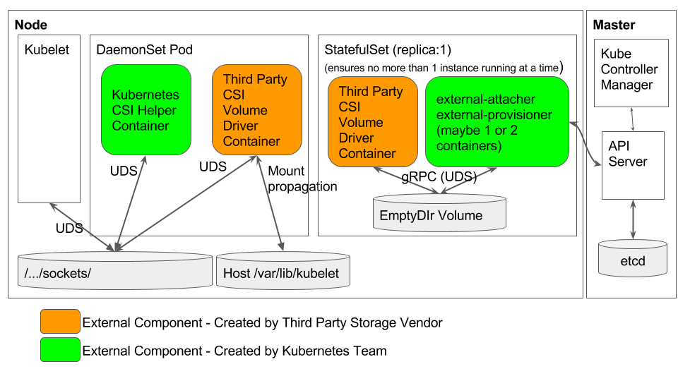

# CSI Volume Plugins in Kubernetes Design Doc
## 术语
* Container Storage Interface(CSI): 容器编排系统(比如Kubernetes等)和存储系统的规范接口。
* in-tree: Kubernetes repo中的代码。
* out-of-tree: Kubernetes repo之外的代码。
* CSI Volume Plugin: 一个新的，in-tree volume plugin，作为kubernetes和第三方的CSI volume driver之间的适配器。
* CSI Volume Driver: Out-of-tree的和CSI兼容的volume plugin的实现。

## 设计概览
* SetUP/TearDown 调用将通过node节点上的**unix domain**直接RPC调用NodePublishVolume和NodeUnpublishVolume。
* Provision/delete和attach/detach将被external component处理：external component代表CSI Volume Driver监控Kubernetes API，然后通过RPC调用合适的CSI volume driver的方法。

## 设计细节
### Communication Channels
#### Kubelet to CSI Drvier Communication
Kubelet：负责mount/unmount，和运行在相同节点上的CSI volume driver通过节点上的Unix Domain Socket通信。
CSI volume driver在节点上创建一个unix domain socket: **/var/lib/kubelet/plugins/[SanitizedCSIDriverName]/csi.sock**。

#### Master to CSI Driver Communication
CSI volume driver被认为是不可信的，不允许在master节点上运行。

Kube-controller-manager：负责create/delete/attach/detach，不能和CSI Volume Driver通过unix domain socket通信。他们之间的通信通过Kubernetes API实现。明确地说，一些外部组件通过List-Watch机制监控Kubernetes API，并触发针对CSI Volume Driver的相应调用。这些**外部组件**通过sidecar的形式和CSI Volume Driver交互。这些**外部组件**要完成的操作包括：provisioning，deleting，attaching和detaching。

## Kubernetes In-Tree CSI Volume Plugin
In-Tree CSI Volume Plugin包括**Kubernetes和CSI volume driver通信所必需的所有逻辑**。
现有的Kubernetes volume components包括:
* attach/detach controller
* PVC/PV controller
* kubelet volume manager
这些组件将会通过CSI volume plugin的操作管理volume的生命周期。

### Internal Interfaces
In-Tree CSI volume plugin将会是实现如下的接口：
1. VolumePlugin: Mounting/Unmounting一个volume到指定的path。
2. AttachableVolumePlugin: Attach/Detach一个volume到指定的node。

ProvisionableVolumePlugin和DeletableVolumePlugin不会被实现，因为针对CSI volume的这两个操作由外部的Provisioner来处理。

### Mount and Unmount

## Recommended Mechanism for Deploying CSI Drivers on Kubernetes

## Example Walkthrough
### Provisioning Volumes
1. A **cluster admin** creates a StorageClass pointing to the CSI driver’s external-provisioner and specifying any parameters required by the driver.
2. A **user** creates a PersistentVolumeClaim referring to the new StorageClass.
3. The **persistent volume controller** realizes that dynamic provisioning is needed, and marks the PVC with a **volume.beta.kubernetes.io/storage-provisioner annotation**.
4. The external-provisioner for the CSI driver sees the PersistentVolumeClaim with the volume.beta.kubernetes.io/storage-provisioner annotation so it starts dynamic volume provisioning:
    1. It dereferences the StorageClass to collect the opaque parameters to use for provisioning.
    2. It calls **CreateVolume** against the CSI driver container with parameters from the StorageClass and PersistentVolumeClaim objects.
5. Once the volume is successfully created, the external-provisioner creates a PersistentVolume object to represent the newly created volume and binds it to the PersistentVolumeClaim.

### Deleting Volumes
1. A user deletes a PersistentVolumeClaim object bound to a CSI volume.
2. The external-provisioner for the CSI driver sees the the PersistentVolumeClaim was deleted and triggers the retention policy:
3. If the retention policy is delete: The external-provisioner triggers volume deletion by issuing a **DeleteVolume** call against the CSI volume plugin container.
4. Once the volume is successfully deleted, the external-provisioner deletes the corresponding PersistentVolume object.
5. If the retention policy is retain: The external-provisioner does not delete the PersistentVolume object.
### Attaching Volumes
1. The Kubernetes **attach/detach controller**, running as part of the kube-controller-manager binary on the master, sees that a pod referencing a CSI volume plugin is **scheduled to a node**, so it calls the in-tree CSI volume plugin’s attach method.
2. The in-tree volume plugin creates a new VolumeAttachment object in the kubernetes API and waits for its status to change to completed or error.
3. The external-attacher sees the VolumeAttachment object and triggers a **ControllerPublish** against the CSI volume driver container to fulfil it (meaning the external-attacher container issues a gRPC call via underlying UNIX domain socket to the CSI driver container).
4. Upon successful completion of the ControllerPublish call the external-attacher updates the status of the VolumeAttachment object to indicate the volume is successfully attached.
5. The in-tree volume plugin watching the status of the VolumeAttachment object in the Kubernetes API, sees the Attached field set to true indicating the volume is attached, so it updates the attach/detach controller’s internal state to indicate the volume is attached.
### Detaching Volumes
1. The Kubernetes **attach/detach controller**, running as part of the kube-controller-manager binary on the master, sees that a pod referencing an attached CSI volume plugin is terminated or deleted, so it calls the in-tree CSI volume plugin’s detach method.
2. The in-tree volume plugin deletes the corresponding VolumeAttachment object.
3. The external-attacher sees a deletionTimestamp set on the VolumeAttachment object and triggers a **ControllerUnpublish** against the CSI volume driver container to detach it.
4. Upon successful completion of the ControllerUnpublish call, the external-attacher removes the finalizer from the VolumeAttachment object to indicate successful completion of the detach operation allowing the VolumeAttachment object to be deleted.
5. The in-tree volume plugin waiting for the VolumeAttachment object sees it deleted and assumes the volume was successfully detached, so It updates the attach/detach controller’s internal state to indicate the volume is detached.
### Mounting Volumes
1. The **volume manager** component of kubelet notices a new volume, referencing a CSI volume, has been scheduled to the node, so it calls the in-tree CSI volume plugin’s **WaitForAttach** method.
2. The in-tree volume plugin’s WaitForAttach method watches the Attached field of the VolumeAttachment object in the kubernetes API to become true, it then returns without error.
3. Kubelet then calls the in-tree CSI volume plugin’s **MountDevice** method which is a no-op and returns immediately.
4. Finally kubelet calls the in-tree CSI volume plugin’s **mount (setup)** method, which causes the in-tree volume plugin to issue a **NodePublishVolume** call via the registered unix domain socket to the local CSI driver.
5. Upon successful completion of the NodePublishVolume call the specified path is mounted into the pod container.
### Unmounting Volumes
1. The **volume manager** component of kubelet, notices a mounted CSI volume, referenced by a pod that has been deleted or terminated, so it calls the in-tree CSI volume plugin’s **UnmountDevice** method which is a no-op and returns immediately.
2. Next kubelet calls the in-tree CSI volume plugin’s **unmount (teardown)** method, which causes the in-tree volume plugin to issue a **NodeUnpublishVolume** call via the registered unix domain socket to the local CSI driver. If this call fails from any reason, kubelet re-tries the call periodically.
3. Upon successful completion of the NodeUnpublishVolume call the specified path is unmounted from the pod container.