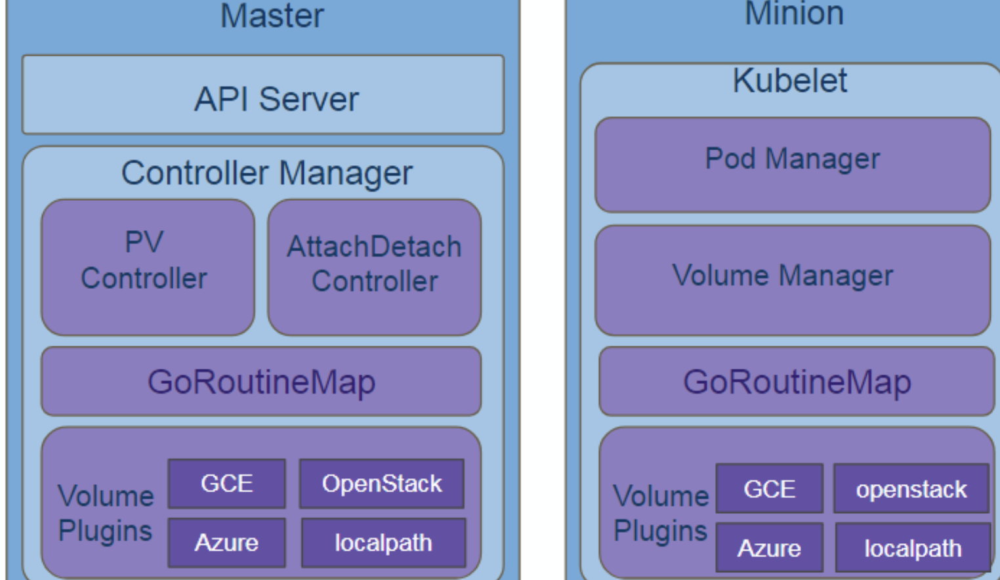

# Kubernetes存储详解
## 存储选型
* 一般应用服务：应用级本身不做数据的冗余，为了数据的安全性，而且这类读写延迟高些也能接受（读写IO路径长，多副本机制，都会增加读写延迟），开源的主流使用ceph（默认采用三副本，设计优雅，理念也是自动化）。
* 数据类服务：本身为了高可用而使用多副本冗余机制，通常对性能和延时有比较高的要求。
    * 简单方案可以采用如hostpath等本地存储方案，妥协点是数据无法迁移（当然，一般数据类系统添加删除节点时，本身有负载均衡功能，所以可以通过删除节点，添加新节点这种“迁移”方式，迁移过程就是对服务有可能所影响）。
    * 使用网络块存储（block device）（性能高的SAN存储）：跟平台解耦，灵活迁移，代价就是延时有些高，性能有些低（像couchbase这类内存Nosql，数据在内存，通过异步刷新数据到磁盘，对磁盘读写延迟一些可以接受的）。
## 概念
### volume
* Kubernetes Volume的生命周期与Pod绑定，容器挂掉后Kubelet再次重启容器时，Volume的数据依然还在。
* 而Pod删除时Volume才会清理。数据是否丢失取决于具体的Volume类型，比如emptyDir的数据会丢失；而PV的数据则不会丢。(官方文档: which is erased when a Pod is removed, the contents of a cephfs volume(其他网络存储一样，即PV) are preserved and the volume is merely unmounted.)
* 限制：
    * 声明POD时，暴露出存储细节，一般用户视角来说，可能不关心，有一定的耦合。
    * 不包含对第三方存储的管理：在声明POD前，对于第三方存储，要先创建好对应的volume，删除POD也需要手动删除volume资源。
### PV/PVC/SC
* PV：Persistent Volumes，是集群之中的一块网络存储。跟Node一样，也是集群的资源。相对于Volume会有独立于Pod的生命周期（有PV controller来实现PV/PVC的生命周期）。
* PVC：PersistentVolumeClaim，对PV的请求，pod声明使用它。（从Storage Admin与用户的角度看PV与PVC：Admin创建和维护PV；用户只需要使用PVC(size和access mode)。
* SC：StorageClass，动态创建PV，不仅节省了管理员的时间，还可以封装不同类型的存储供PVC选用。就是封装了对第三方网络存储的管理操作，这样就不用手动创建volume或者手动声明一个PV。
## K8S存储主要模块

* Volume Plugins： 存储提供的扩展接口，包含了各类存储提供者的plugin实现。
* Volume Manager：
    * 运行在kubelet中让存储Ready的部件，主要是mount/unmount（attach/detach可选）。
    * Pod调度到这个node上后才会有卷的相应操作，所以它的触发端是kubelet（严格讲是kubelet里的pod manager）。根据Pod Manager里pod spec里声明的存储来触发卷的挂载操作。
        * Kubelet会监听到调度到该节点上的pod的声明，会把pod缓存到Pod Manager中，VolumeManager通过Pod Manager获取PV/PVC的状态，并进行分析出具体的attach/detach、mount/umount操作，然后调用volume plugin进行相应的处理。
* PV/PVC Controller
    * 运行在Master上的部件，主要做provision/delete
    * PV Controller和K8S其它组件一样监听API Server中的资源更新，对于卷管理主要是监听PV、PVC、SC三类资源，当监听到这些资源的创建、删除、修改时，PV Controller经过判断是需要做创建、删除、绑定、回收等动作。
* Attach/Detach Controller
    * 运行在Master上，主要做一些块设备（block device）的attach/detach（比如rbd，cinder块设备需要在mount之前先挂载到主机上)。
    * 非必须controller: 为了在attach卷上支持plugin headless形态，Controller Manager提供配置可以禁用。
    * 它的核心职责就是当API Server中有卷声明的pod与node间的关系发生变化时，需要决定是通过调用存储插件将这个pod关联的卷attach到对应node的主机（或者虚拟机）上，还是将卷从node上detach掉。

## K8S挂载（mount）卷的基本过程包括：
1. 用户通过API创建一个包含PVC的Pod。
2. Scheduler把这个Pod分配到某个节点，比如Node1。
3. Node1上的Kubelet开始等待`Volume Manager`准备设备。
4. PV controller调用相应Volume Plugin创建持久卷并在系统中创建PV对象，以及与PVC绑定。
5. Attach/Detach controller或者`Volume Manager`通过Volume Plugin实现device挂载（Attach）。
6. `Volume Manager`等待device挂载完成后，将卷mount到"节点指定目录"， 比如`/var/lib/kubelet/pods/<pod uid>/volumes/aws-ebs/<volume name>`。
7. Node1上的Kubelet此时被告知volume已经准备好后，开始启动Pod，通过docker volume mapping将已经mount到节点上的PV"挂载"到相应的容器中去。

针对第6步骤，其实对于Kubernetes中大部分的Volume Plugin来说，mount的过程遵循着如下的规则：

`/some/global/mount/path -> /var/lib/kubelet/pods/<pod uid>/volumes/<volume plugin>/<volume name> -> container volume`

不过对于`hostpath`这个plugin而言就是

`/some/global/mount/path -> container volume`