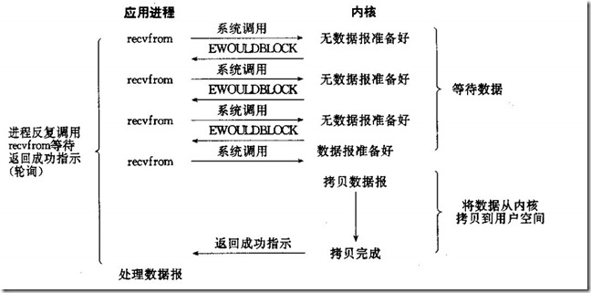
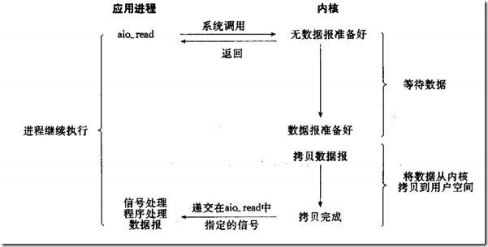

# 阻塞和非阻塞、异步和同步
## 阻塞式IO模型

应用进程在调用recvfrom系统调用之后，会有两个阶段：
1. waiting for the data ready
2. copy the data from kernel to process
在这两个阶段，应用进程都是**blocked**的。
## 非阻塞式IO模型

应用进程在调用recvfrom系统调用之后，
* 如果data is not ready，则系统调用返回error，不会block应用进程。
* 如果data is ready，则系统调用进入copy阶段，block应用进程。
这就要求应用进程在data is not ready时，需要不断的轮询，一直到data is ready为止。

阻塞和非阻塞是针对whether the data is ready来说的。不管是哪个block/non-block IO模型，copy这个阶段都是阻塞的。
## 多路复用IO模型

多路复用模型是阻塞的。与block模型相比，select可以同时监听多个fd，所以效率更高。 copy这个阶段也是阻塞的。
## 信号驱动IO模型

信号驱动模型，与nonblock模型相比，第一个阶段不需要轮询操作来判断data is ready。当data is ready时，应用进程会收到信号通知。copy这个阶段还是阻塞的。
## 异步IO模型

该模型不但等待数据ready的过程不阻塞，copy这个阶段也不阻塞。当数据拷贝完成，应用进程会收到信号通知。
所以整个过程都不阻塞——**异步**的。
