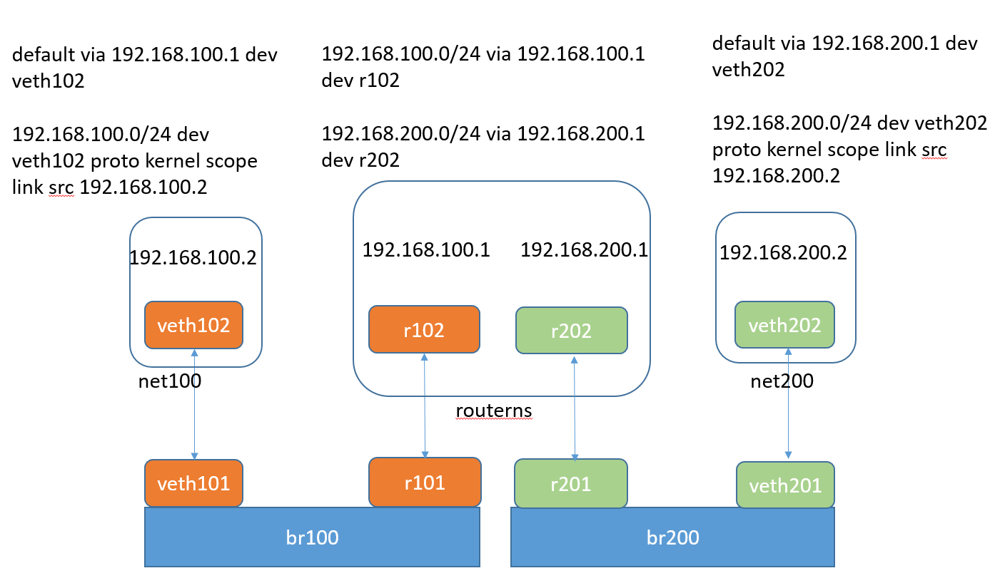

# Bridge之间通过路由联通
## 实践
以下按照下图构建网络

### 创建两个namespace
```sh
ip netns add net100
ip netns add net200
```
### 配置网络br100
创建一个网桥br100，并创建一对vethpair veth101和veth102，然后将veth101加入网桥，然后将veth102加入net100。
```sh
ip link add dev br100 type bridge
ip link add dev veth101 type veth peer name veth102
ip link set veth101 master br100
ip link set veth102 netns net100
```
为veth102配置ip地址，并设置默路由
```sh
ip netns exec net100 ip addr add 192.168.100.2/24 dev veth102
ip netns exec net100 ip route add default via 192.168.100.1 dev veth102
```
启用三个设备
```sh
ip link set br100 up
ip link set veth101 up
ip netns exec net100 ip link set veth102 up
```
### 配置网络br200
```sh
ip link add dev br200 type bridge
ip link add dev veth201 type veth peer name veth202
ip link set veth201 master br200
ip link set veth202 netns net200

ip netns exec net200 ip addr add 192.168.200.2/24 dev veth202
ip netns exec net200 ip route add default via 192.168.200.1 dev veth202

ip link set br200 up
ip link set veth201 up
ip netns exec net200 ip link set veth202 up
```
### 配置网关及路由
增加网关ns
```sh
ip netns add routerns
```
在routerns中配置br100的网关
```sh
ip link add dev r101 type veth peer name r102
ip link set r101 master br100
ip link set r102 netns routerns
ip netns exec routerns ip addr add 192.168.100.1/24 dev r102
```
在routerns中配置br200的网关
```sh
ip link add dev r201 type  veth peer name r202
ip link set r201 master br200
ip link set r202 netns routerns
ip netns exec routerns ip addr add 192.168.200.1/24 dev r202
```
配置路由
```sh
ip netns exec routerns ip route add 192.168.200.0/24 via 192.168.200.1 dev r202
ip netns exec routerns ip route add 192.168.100.0/24 via 192.168.100.1 dev r102
```
启用设备
```sh
ip link set r101 up
ip netns exec routerns ip link set r102 up
ip link set r201 up
ip netns exec routerns ip link set r202 up
```
## 测试联通性
```sh
ip netns exec net100 ping 192.168.200.2
PING 192.168.200.2 (192.168.200.2) 56(84) bytes of data.
64 bytes from 192.168.200.2: icmp_seq=1 ttl=63 time=0.109 ms
64 bytes from 192.168.200.2: icmp_seq=2 ttl=63 time=0.156 ms
```
```sh
ip netns exec net200 ping 192.168.100.2
PING 192.168.100.2 (192.168.100.2) 56(84) bytes of data.
64 bytes from 192.168.100.2: icmp_seq=1 ttl=63 time=0.100 ms
64 bytes from 192.168.100.2: icmp_seq=2 ttl=63 time=0.166 ms
```