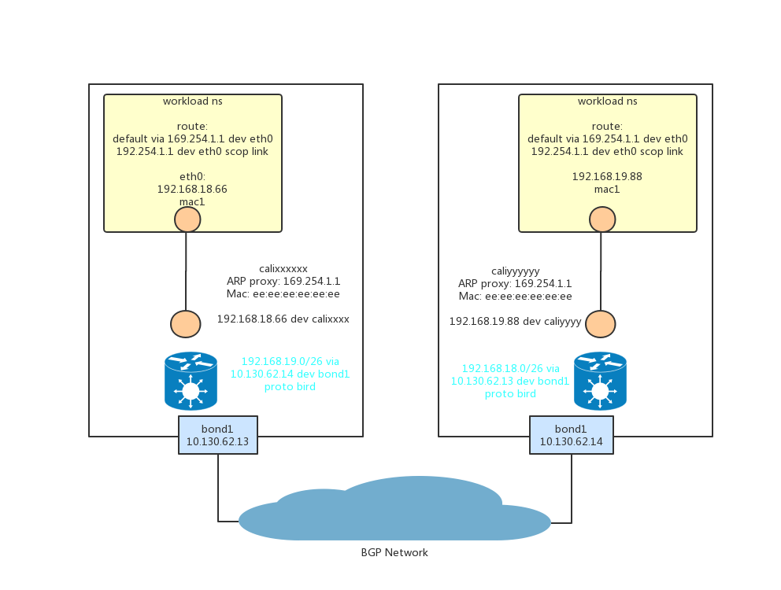

# Calico网络
## 概述
Calico是一个纯三层路由的方案。

Calico每个Node节点作为一个vRouter，并且运行BGP协议（通过Bird实现）。
## Calico网络架构
基于BGP的网络架构图如下所示：


### 节点和workload之间的链路
每个workload关联一个veth pair。 workload的一端（wlVeth）深入到workload的namespace之内；另一端留在host上，称为hostVeth。

其中wlVeth配置IP/MAC地址，而hostVeth不配置IP，配置MAC(ee:ee:ee:ee:ee:ee)。

在workload的namespace中配置路由表：
```sh
# ip route
default via 169.254.1.1 dev eth0 
169.254.1.1 dev eth0 scope link 
```

这样workload出去的流量都会转发到169.254.1.1这个`网关地址`。而这个网关地址并没有配置到hostVeth一端。而是在hostVeth一段配置ARPProxy。当workload发出针对169.254.1.1的ARP请求时，hostVeth以自己的mac地址响应该请求。

```sh
# ip neigh
169.254.1.1 dev eth0 lladdr ee:ee:ee:ee:ee:ee DELAY
```

没当一个workload在主机上创建后，在主机的路由表里面，会增加一条针对该workload的路由，该路由直接指向workload对应的hostVeth。
```sh
192.168.186.66 dev calie56186e54c0 scope link 
```

这就打通了workload到主机的通路。这些是由Calico CNI来维护的。
### 节点和节点之间的链路
通常来说，每个节点都是一个vRouter，并且拥有全部workload的路由，并且vRouter通过BGP协议把路由通告到所有节点及节点之间的路由器上（这就要求节点之间的路由器支持BGP协议）。
这些由Bird来维护。
BGP具有聚合路由的功能。所以，针对主机外的workload，并不是每个workload都有一条独立的路由，而是聚合成一个小的网段。

比如，所有`192.168.19.0/26`网段的都会转发到`10.130.62.14`主机。
```sh
192.168.19.0/26 via 10.130.62.14 dev bond1 proto bird 
```