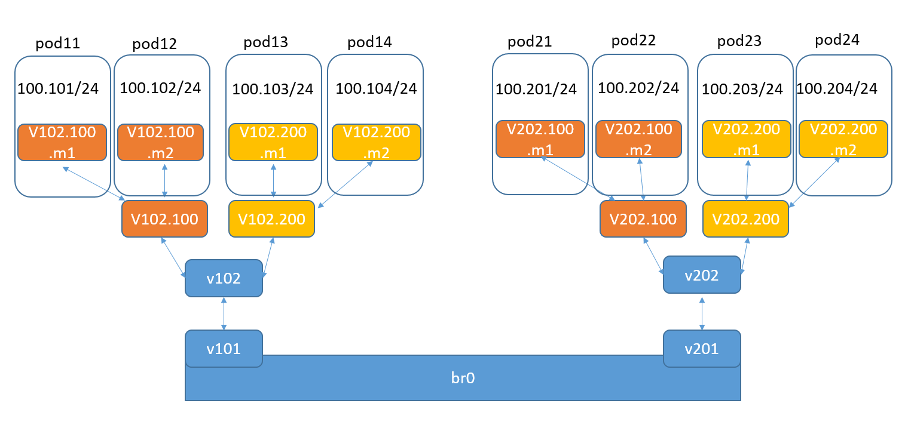

# Vlan+Macvlan多租户网络
## 环境说明
VirtualBox虚拟机，Centos 7.2。
```sh
uname -r
3.10.0-862.el7.x86_64
```
安装bridge-utils软件包，并加载bridge模块和开启内核转发。
```sh
apt-get install bridge-utils
modprobe bridge

echo "1">/proc/sys/net/ipv4/ip_forward

cat /proc/sys/net/ipv4/ip_forward
1
```
## 构建网络
本文按照如下图构建网络

### 构建主干网络
本部分在现实中都是物理网络。
```sh
ip link add dev br0 type bridge
ip link add dev v101 type veth peer name v102
ip link add dev v201 type veth peer name v202
```
### 创建主机网络（左）
#### 主机网络部分
主机网络分为两个vlan
```sh
ip link add link v102 dev v102.100 type vlan id 100
ip link set dev v102.100 promisc on
ip link add link v102 dev v102.200 type vlan id 200
ip link set dev v102.200 promisc on
```
#### 创建容器网络
```sh
ip link add link v102.100 dev v102.100.m1 type macvlan mode bridge
ip link add link v102.100 dev v102.100.m2 type macvlan mode bridge
ip link add link v102.200 dev v102.200.m1 type macvlan mode bridge
ip link add link v102.200 dev v102.200.m2 type macvlan mode bridge

ip netns add pod11
ip netns add pod12
ip netns add pod13
ip netns add pod14

ip link set dev v102.100.m1 netns pod11
ip link set dev v102.100.m2 netns pod12
ip link set dev v102.200.m1 netns pod13
ip link set dev v102.200.m2 netns pod14

ip netns exec pod11 ip addr add 192.168.100.101/24 dev v102.100.m1
ip netns exec pod12 ip addr add 192.168.100.102/24 dev v102.100.m2
ip netns exec pod13 ip addr add 192.168.100.103/24 dev v102.200.m1
ip netns exec pod14 ip addr add 192.168.100.104/24 dev v102.200.m2
```
#### 开启所有设备
```sh
ip netns exec pod11 ip link set dev v102.100.m1 up
ip netns exec pod12 ip link set dev v102.100.m2 up
ip netns exec pod13 ip link set dev v102.200.m1 up
ip netns exec pod14 ip link set dev v102.200.m2 up

ip link set dev v102.100 up
ip link set dev v102.200 up

ip link set dev v102 up
ip link set dev v101 up
```

### 创建主机网络（右）
#### 主机网络部分
主机网络分为两个vlan
```sh
ip link add link v202 dev v202.100 type vlan id 100
ip link set dev v202.100 promisc on
ip link add link v202 dev v202.200 type vlan id 200
ip link set dev v202.200 promisc on
```
#### 创建容器网络
```
ip link add link v202.100 dev v202.100.m1 type macvlan mode bridge
ip link add link v202.100 dev v202.100.m2 type macvlan mode bridge
ip link add link v202.200 dev v202.200.m1 type macvlan mode bridge
ip link add link v202.200 dev v202.200.m2 type macvlan mode bridge

ip netns add pod21
ip netns add pod22
ip netns add pod23
ip netns add pod24

ip link set dev v202.100.m1 netns pod21
ip link set dev v202.100.m2 netns pod22
ip link set dev v202.200.m1 netns pod23
ip link set dev v202.200.m2 netns pod24

ip netns exec pod21 ip addr add 192.168.100.201/24 dev v202.100.m1
ip netns exec pod22 ip addr add 192.168.100.202/24 dev v202.100.m2
ip netns exec pod23 ip addr add 192.168.100.203/24 dev v202.200.m1
ip netns exec pod24 ip addr add 192.168.100.204/24 dev v202.200.m2
```
#### 开启所有设备
```sh
ip netns exec pod21 ip link set dev v202.100.m1 up
ip netns exec pod22 ip link set dev v202.100.m2 up
ip netns exec pod23 ip link set dev v202.200.m1 up
ip netns exec pod24 ip link set dev v202.200.m2 up

ip link set dev v202.100 up
ip link set dev v202.200 up

ip link set dev v202 up
ip link set dev v201 up
```
### 主机网络联通
```sh
ip link set dev v101 master br0
ip link set dev v201 master br0
ip link set dev v101 up
ip link set dev v201 up
ip link set br0 up
```

## 网络连通性测试
从图上可以看出，我们将所有的pod的ip都设置为100网段内，使其使用直连路由，测试二层连通性。

从以下结果可以看出：
pod11和pod12，pod21，pod22同属于一个vlan，二层是联通的。
pod11和pod13，pod14，pod23，pod24不属于同一个vlan，二层是不通的。

```sh
-----------------------------------------------------------------
ip netns exec pod11 ping 192.168.100.102 -c 2
PING 192.168.100.102 (192.168.100.102) 56(84) bytes of data.
64 bytes from 192.168.100.102: icmp_seq=1 ttl=64 time=0.057 ms
64 bytes from 192.168.100.102: icmp_seq=2 ttl=64 time=0.143 ms

--- 192.168.100.102 ping statistics ---
2 packets transmitted, 2 received, 0% packet loss, time 999ms
rtt min/avg/max/mdev = 0.057/0.100/0.143/0.043 ms
-----------------------------------------------------------------
ip netns exec pod11 ping 192.168.100.103 -c 2
PING 192.168.100.103 (192.168.100.103) 56(84) bytes of data.
^C
--- 192.168.100.103 ping statistics ---
2 packets transmitted, 0 received, 100% packet loss, time 999ms

-----------------------------------------------------------------
ip netns exec pod11 ping 192.168.100.104 -c 2
PING 192.168.100.104 (192.168.100.104) 56(84) bytes of data.
^C^H^H

--- 192.168.100.104 ping statistics ---
2 packets transmitted, 0 received, 100% packet loss, time 999ms

-----------------------------------------------------------------
ip netns exec pod11 ping 192.168.100.201 -c 2
PING 192.168.100.201 (192.168.100.201) 56(84) bytes of data.
64 bytes from 192.168.100.201: icmp_seq=1 ttl=64 time=0.263 ms
64 bytes from 192.168.100.201: icmp_seq=2 ttl=64 time=0.144 ms

--- 192.168.100.201 ping statistics ---
2 packets transmitted, 2 received, 0% packet loss, time 1001ms
rtt min/avg/max/mdev = 0.144/0.203/0.263/0.061 ms

-----------------------------------------------------------------
ip netns exec pod11 ping 192.168.100.202 -c 2
PING 192.168.100.202 (192.168.100.202) 56(84) bytes of data.
64 bytes from 192.168.100.202: icmp_seq=1 ttl=64 time=0.154 ms
64 bytes from 192.168.100.202: icmp_seq=2 ttl=64 time=0.127 ms

--- 192.168.100.202 ping statistics ---
2 packets transmitted, 2 received, 0% packet loss, time 1000ms
rtt min/avg/max/mdev = 0.127/0.140/0.154/0.017 ms

-----------------------------------------------------------------
ip netns exec pod11 ping 192.168.100.203 -c 2
PING 192.168.100.203 (192.168.100.203) 56(84) bytes of data.

--- 192.168.100.203 ping statistics ---
2 packets transmitted, 0 received, 100% packet loss, time 999ms

-----------------------------------------------------------------
ip netns exec pod11 ping 192.168.100.204 -c 2
PING 192.168.100.204 (192.168.100.204) 56(84) bytes of data.

--- 192.168.100.204 ping statistics ---
2 packets transmitted, 0 received, 100% packet loss, time 999ms

```
